TCAdpater接入文档

1\. 修改历史 3

2\. 随心播运行指南 3

2.1. 随心播功能说明 3

2.2. 随心播下载与运行 3

2.3. 随心播运行注意事项 5

3\. 导入框架 6

3.1. 架构设计及说明 6

3.2. TCAdapter如何复用框架进 7

3.3. 框架集成 9

3.3.1. 配置新的工程 9

3.3.2. 导入CommonLibrary 11

3.3.3. 导入TCAdapter 12

3.3.4. 配置托管模式登录功能 13

3.3.5. 添加主界面后的效果 14

3.3.6. 配置App参数 15

4\. 开发指南 16

4.1. 准备工作 16

4.2. 账号登录 17

4.2.1. 随心播中的帐号登录 18

4.2.2. 常见问题 18

4.3. 初始化SDK 18

4.3.1. IMSDK初始化 18

4.3.2. AVSDK上下文初始化 21

4.4. 修改云后台编码配置 22

4.4.1. 直播SPEAR配置 22

4.4.2. 互动直播SPEAR配置 23

4.4.3. 直播/互动直播配置对比说明 25

4.5. 创建直播间对象 26

4.6. 进入直播/互动直播 27

4.6.1. 添加直播/互动直播界面对象 27

4.6.2. 创建直播/互动直播 28

4.6.3. 加入直播/互动直播 28

4.6.4. 注意事项 29

4.7. 进入房间后的配置 30

4.7.1. 接入自定义直播引擎 30

4.7.2. 配置角色权限以扩进房间后的操作 31

4.8. 退出直播/互动直播 34

4.9. 业务UI集成 35

4.10. 自定义渲染控件 36

5\. 直播中的功能点讲解 37

5.1. 硬件权限以及网络检查 37

5.1.1. 进入前检查 37

5.1.2. 使用中检查 38

5.2. 进房间流程定制 39

5.3. 推流/录制 40

5.3.1. 推流设置 40

5.3.2. 录制设置 41

5.4. 中断处理 42

5.4.1. 电话中断 42

5.4.2. 前后台切换 42

5.4.3. 音频中断 43

5.4.4. IM互踢 43

5.5. 上麦/下麦流程 44

5.6. 性能优化 45

修改历史 
=========

  ---------- ------------ -----------
  日期       修改说明     作者
  20160725   1.添加初稿   AlexiChen
  ---------- ------------ -----------

随心播运行指南
==============

随心播功能说明
--------------

随心播是基于腾讯云*云通信（IMSDK）*与*互动直播（AVSDK）*，用于对外部用户演示与集成的产品，并上传至*AppStore*（用户亦可在AppStore搜索随心播进行下载）。其包含常用直播/互动直播两个场景（AppStore版本对外只显示了互动直播场景）。其演示了IMSDK与AVSDK结合进行直播、互动直播时如何进行画面请求与渲染，聊天消息，信令控制，推流录制等。

随心播下载与运行
----------------

因业务需要，将随心播的代码上传至*GitHub*，GitHub定期会有更新与维护，其使用的SDK版本较腾讯云上的版本会较新（原*腾讯云互动直播*上只存放正式版本，GitHub使用的IMSDK与AVSDK可能会是最新的稳定版本）。

用户打开*GitHub*后，可以Star随心播，这样腾讯更新代码时，GitHub会通知到。同时注意阅读ReadMe。用户也可以在GitHub上给随心播提issue，我们会定期查看并回复。

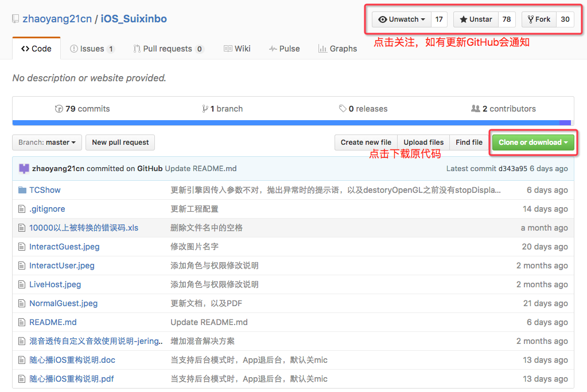

用户点击右上角Clone or
download下载代码到本地后，注意阅读ReadMe，因GitHub有文件大小限制，我们将AVSDK+IMSDK存储在腾讯云COS服务上，用户还需要去对应下载SDK文件，并按照说明解压到对应的目录。

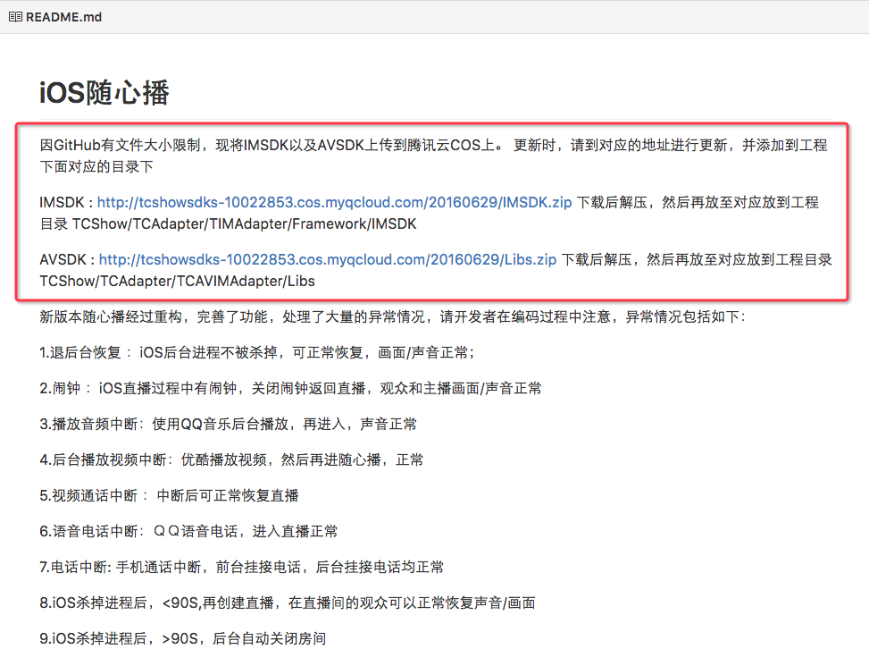

下载并解压代码与并下载配置好SDK后，如下图：

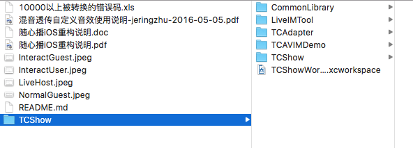

  ------------------------- ----------------------------------------------------------------------------------------------------------------------------
  文件名                    说明
  10000以上被转换的错误码   出现10000以上错误时，先将日志开启，再重现，然后搜索日志中ERROR. SERVER\_ERROR. server ret\_code 再对比码表找到对应的错误码
  随心播iOS重构说明         随心播代码导读
  ReadMe + 4张JPEG          ReadMe说明，以及Spear推荐配置说明
  TCShow                    源代码目录
  TCShow/CommonLibrary      代码中的工具包，以及UI框架
  TCShow/TCAdapter          重构以及复用的核心部分
  TCShow/LiveIMTool         IM工具，用于直播间内消息压测
  TCShow/TCAVIMDemo         集成演示Demo，以及一些不常用的，不同场景，不便于在随心播中演示的功能，会在此处进行演示
  TCShow/TCShow             随心播工程目录
  ------------------------- ----------------------------------------------------------------------------------------------------------------------------

打开iOS\_Suixinbo/TCShow目录下的TCShowWorkSpace.xcworkspace，打开后选择好对应的TCShow
Target，连接上真机，配置好证书，即可运行真机上，创建直播并与其他人进行互动。用户也可以直接打开iOS\_Suixinbo/TCShow/TCShow/TCShow.xcodeproj。

随心播运行注意事项
------------------

用户在真机上运行时，在进入到直播发布页可以看到的开始直播与开始互动直播两个按钮（见下图一），分别点击进入后对应直播界面（图二）与互动直播界面（图三），虽然在随心播里面直播与互动直播可以互看，而且界面也非常类似，但是互动直播内部逻辑较直播要复杂很多，如果用户只是做直播，为方便用户进行代码阅读，可将代码的宏kSupportMultiLive改为0，以便理解代码逻辑。

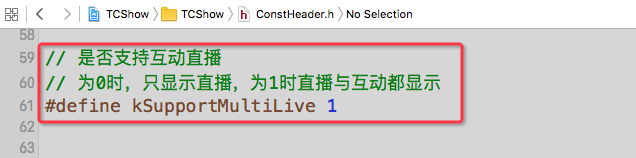

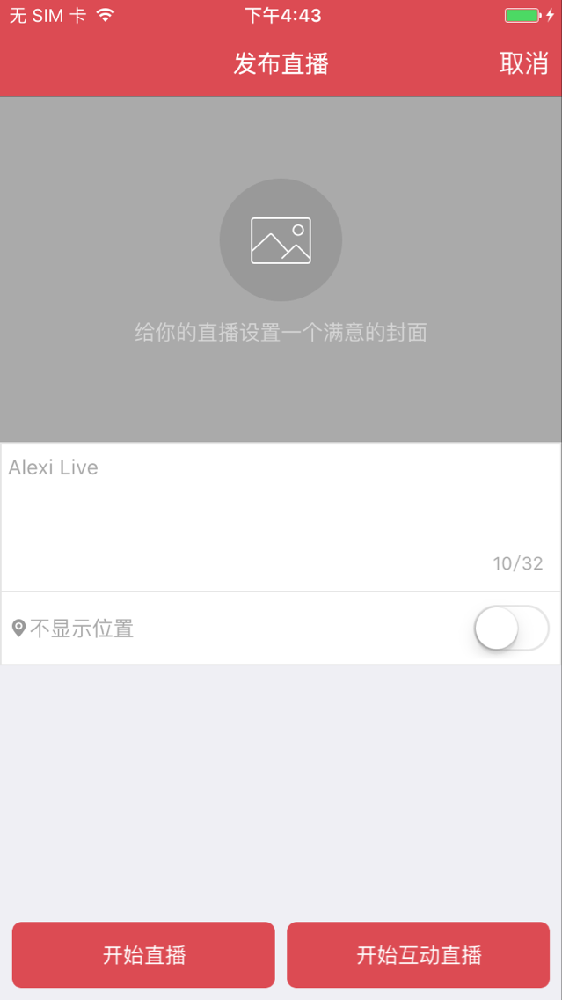 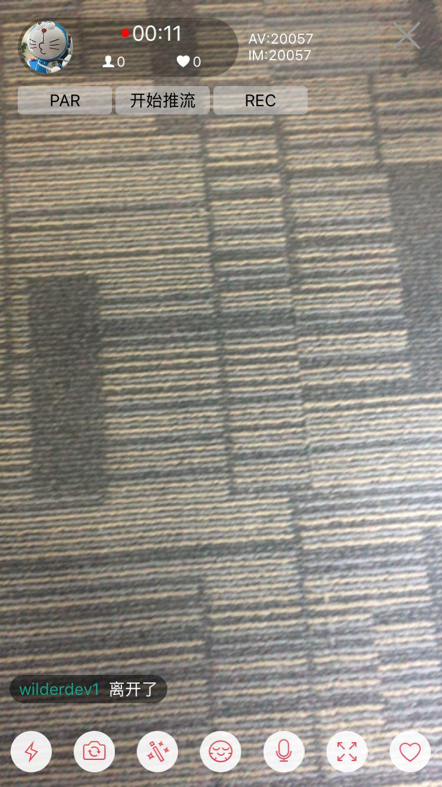 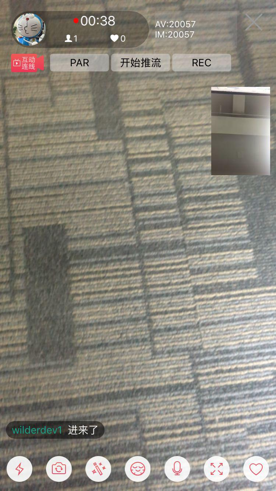

（图一） （图二） （图三）

导入框架
========

架构设计及说明
--------------

通用的App框架是基于系统（OS System Service），自底向上分作三层：

-   App Core
    Service：App核心服务层，对外提供核心功能（如IMSDK，AVSDK）等；

-   App Adapter：业务逻辑适配层，App根据自身的业务不同，将App Core
    Service提供的核心功能进行封装，以方便外部使用；

-   App UI：各功能模块对就看整屏界面，主要负责界面内部Custom
    UI的布局与调度；

    -   Custom UI :
        > 自定义UI层，主要作用是把界面上的大模块拆分到小的自定义的小模块（Custom
        > View）中进行实现，实际开发中隶属于AppUI，可在各App　UI模块中进行复用的部分；

<!-- -->

-   Common
    Library：公用代码库，主要基础工具类，第三方代码等，用作代码搜集以及后期复用；

通用App框架各分层通信模型如下：

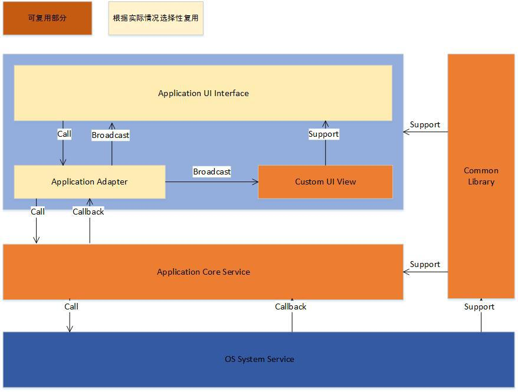

各箭头含义:

Call：调用

CallBack：回调

Broadcast：广播

Support：支撑/支持

TCAdapter如何复用框架进
-----------------------

为了方便用户进行集成，我们设计TCAdapter，将AVSDK与IMSDK进行再封装，降低用户使用AVSDK+IMSDK来开发直播场景等业务类App门槛：

-   用户可以通过集成TCAdapter来扩展自身业务逻辑，集成者更多地关注自身的业务逻辑上的处理；

-   TCAdapter中处理了大量直播中常见的问题，这些问题处理让用户自行实现的话可能会比较麻烦；

-   TCAdapter经过测试，稳定性上有一定的保证；

TCAdapter对应通用框架即为下图

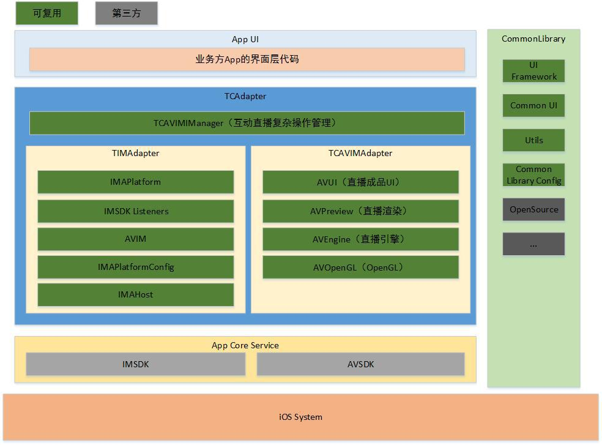

熟悉过*TCAdapter*中的代码后，你会发现其对应基本模型如下图，其每个模块都有默认的内容，并且也都支持定制扩展。TCAdapter内部负责管理各模块之间的协作，实际开发中，用户只要逐一完成一个个模块即可。

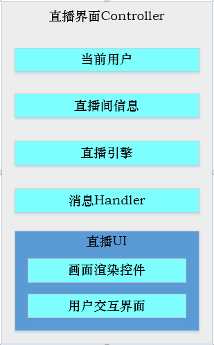

随心播集成TCAdapter之后对应层次即为下图，其他业务集成后对应的层次图也如下

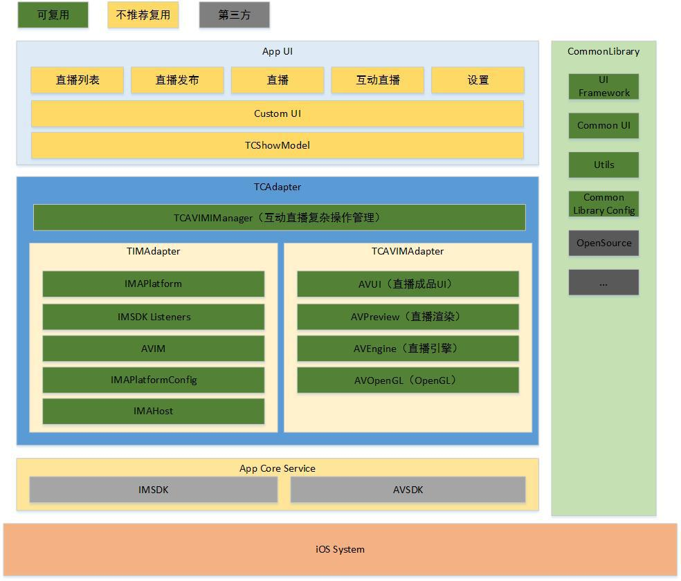

其他第三方在集成TCAdapter时，同样也需要可以复用的TCAdapter（里面已将App
Core Service的SDK添加到其中），CommonLibrary，然后再实现其App
UI部分（主要指跟直播、互动直播相关的模块）。

框架集成
--------

以创建
TCAVIMDemo为例，过程中会介绍已有项目如何集成，每进行一步结束时，都Build一下，以确保每步都正常。

### 配置新的工程

若当前为新工程TCAVIMDemo，并删除默认生成的内容，设置Enable BitCode
为NO，设置Other Linker Flags 为 -ObjC（注意大小写），增加PCH文件

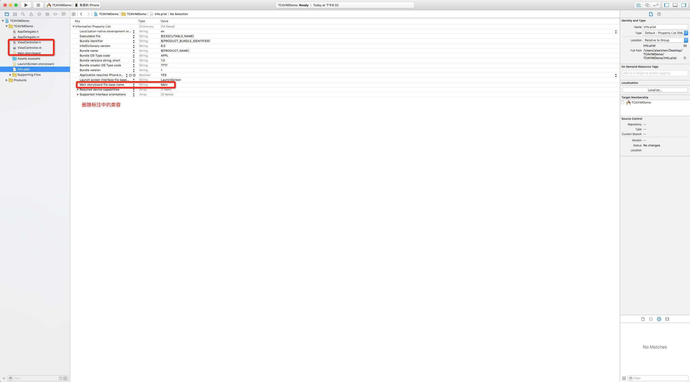

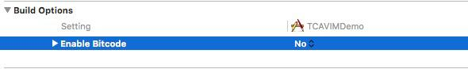

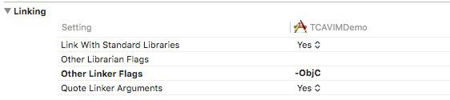

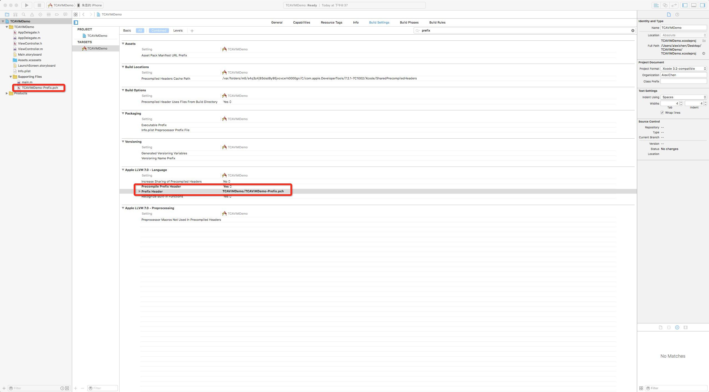

### 导入CommonLibrary

导入CommonLibrary，添加到PCH，并添加Compiler Flags

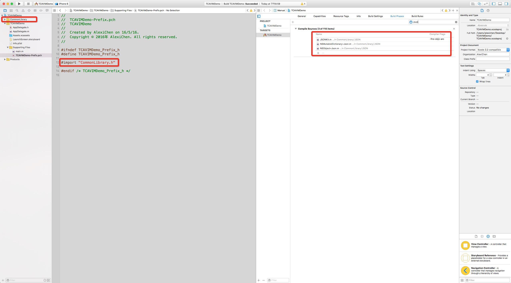

此时用户若只想用CommonLibrary进行App开发，还需要配置AppDelegate，

修改前

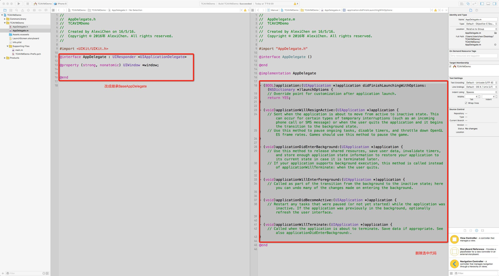

修改后

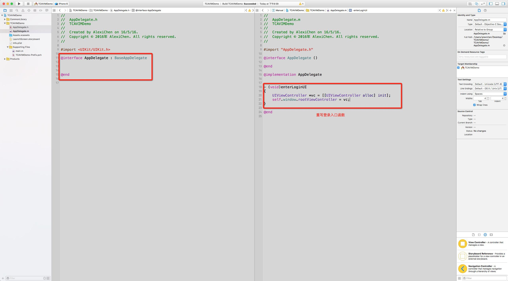

### 导入TCAdapter

导入TCAdapter，添加到PCH，添加依赖库（因可能文档没有及时更新，请以TCShow中SystemLibrary为准），添加Compiler
Flags，请注意阅读红字部分

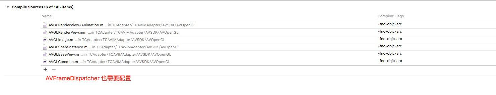

若用户参考的是Demo中目录结构（CommonLibrary与TCAdapter不在当前工程目录下），注意配置以下Search
Path，以确保能访问到正确的目录（下图实际配置与App相关只作参考）

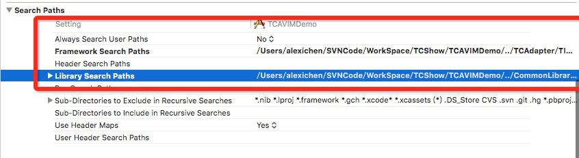

完成以上步骤，即可编译成功，用户在保证编译成功的前提下，再继续后面的步骤。

1.8.1之后的版本请注意添加 libresolv.tbd
(用于支持ipv6)，另外XCode7.3(在写该文档时，已升级到7.3，低版本未试过)
的用户编译后可能会报下面的问题，不要惊慌，其不影响在真机上调试，至于为什么报错（网上了解到的是跟C++有关），暂未找到具体解决办法，后续如有找到，再更新该处

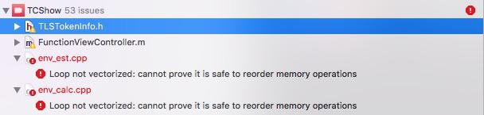

在完成以上步骤时，再进行*配置AppID*即已完成TCAdapter框架的集成了，后续的*第四步*，*第五步*只是介绍如何配置与简单的使用。

### 配置托管模式登录功能

配置AppDelegate ，使用支持登录功能

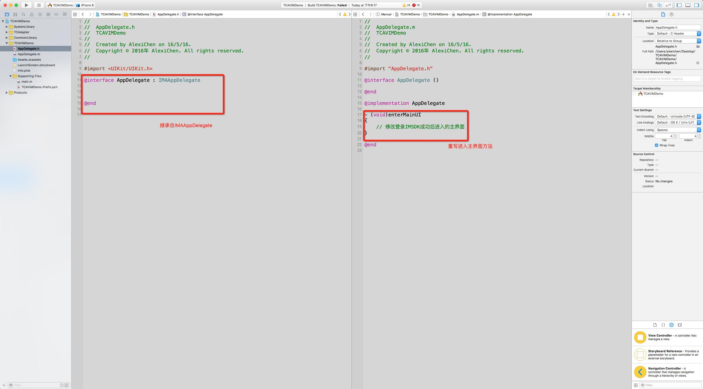若不是新建的工程，而是在现有代码上集成，此处注意：

-   用户根据情况而定，看是否需要继承IMAAppDelegate;

-   若不能直接继承IMAAppDelegate,用户需要参考IMAAppDelegate,以及BaseAppDelegate代码
    ，将相关逻辑移植到现有的代码中。

### 添加主界面后的效果

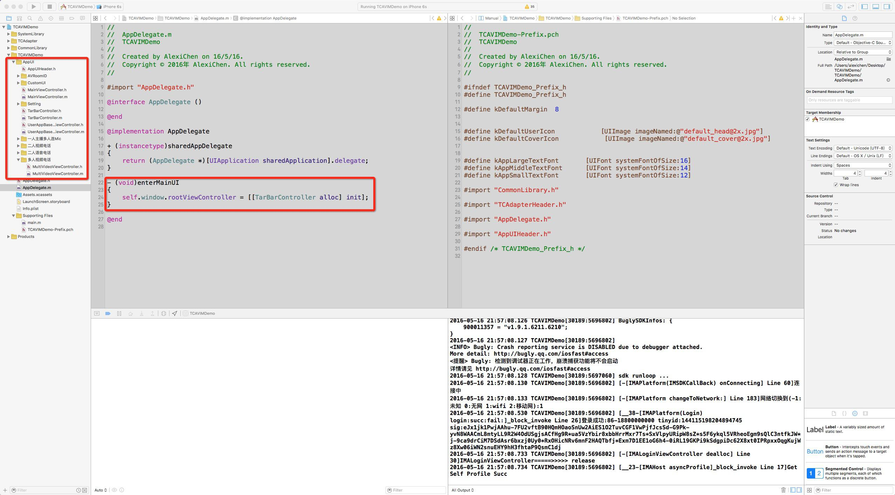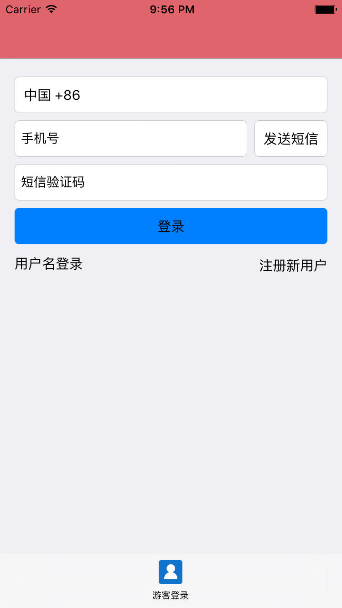 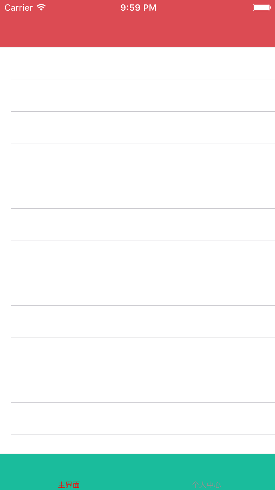

界面中一些基本的样式，可能通通修改BaseAppDelegate中的CommonLibraryConfig.h中的配置进行修改，如果不符合要求，可修改原代码（后期合并时注意）

另外用户如果想重写登录界面，可重写enterLoginUI方法即跳转到自己的登录界面，注意自已界面内与IMALoginViewController内部登录逻辑一致，确保IMSDK能正确登录。

另外请注意：若用户app使用了国际化，请将TCAdapter/TIMAdapter/Localizable.strings文件与自己app的国际化字符串文件进行合并

### 配置App参数

修改自己App申请的AppID以及AccountType

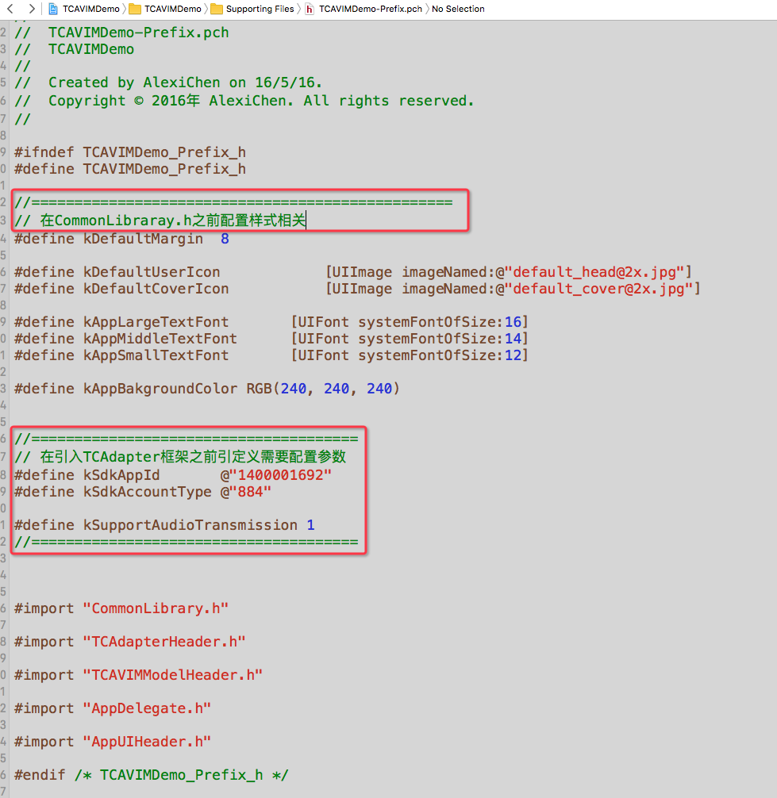

配置完以上步骤即可使用TCAdapter进行开发了，集成示例TCAVIMDemo中，使用其编写了几个简单的场景，详见代码。

开发指南
========

业务方在集成TCAdapter进行开发时，最好不要对框架内的代码作修改，原因如下：

-   后期Demo有更新，TCAdapter有可能会有修改，这样可避免因Demo修改了，影响用户App的使用，另外当demo修改了，用户可集成只需要关注其重写的方法是否有修改，这样替换时工作量较小；

-   可通过继承来扩展自身逻辑，尽量重写Protected类别中的方法，如果重写类中的方法，注意保证与原类的逻辑一致；

下面结合随心播，重点介绍如何一步一步开发自己的直播/互动直播App，以及如何快速接入直播。

准备工作
--------

-   在进行开发之前，需要申请腾讯云帐号，并在腾讯云上创建应用接入，拿到对应的AppID以及AccountType（腾讯云审核需要一段时间，期间可以用随心播的AppID以及AccountType进行测试，后期可再替换）；如果用户想在随心播上用自己的AppID先体验一下，那么可以修改随心播的配置成自己的AppID与AcoountType：修改后同时要把kIsTCShowSupportIMCustom改为0。修改之后，如果还不成功，请查下你的AppID是否对应为独立模式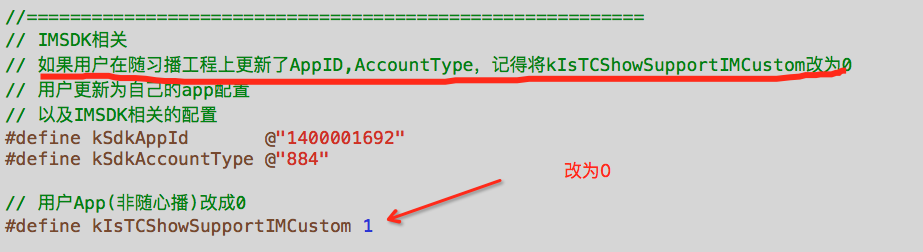

-   在进行开发自业务前，先使用随心播，查看其直播/互动直播场景逻辑是否符合自身的需要（这也是*随心播框架*中不推荐复用的原因之一），如果对比发现不同或有特殊需求，最好先在支持群内反馈是否支持，避免后期出现问题；

-   对于在已有App上集成时，用户需要根据具体情况下配置AppDelegate。如果直接从BaseAppDelegate中有可能会影响已有功能（主要是样式相关的内容），那么可以修改下面的配置（将kIsIMAppFromBase改为0），实现快速集成。

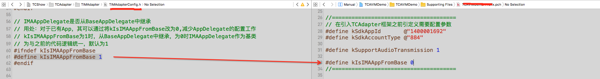

下图为随心播中kIsIMAppFromBase为0时对应的修改（用户可自行修改此值以查看具体效果）。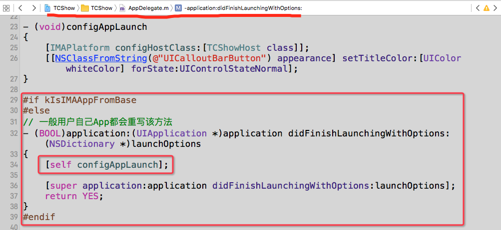

-   提前说明一下：App内部要有用户协议声明以及举报功能，在开发前请检查App设计是否存在这样的功能：下图为老版本上AppStore被拒邮件：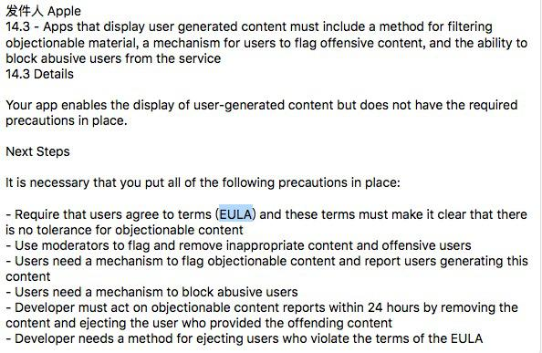

上传AppStore时，注意说明测试步骤，记得附带演示视频：新集成的App
上线有可能直播列表页是空的，会导致审核人员无法正确使用你的App的功 能。

账号登录
--------

腾讯云帐号登录体系分为两类：*托管模式*，*独立模式*。二者区别：

托管模式：托管模式是指，由TLS（Tencent Login
Service）为开发者提供APP帐号的密码注册、存储和密码验证，以及第三方openid和token的托管验证服务。帐号验证成功后，派发私钥加密生成的签名到客户端，APP业务服务器可以通过下载的公钥解密签名进行验证。

独立模式：用户注册和身份验证由开发者负责，开发者和腾讯之间通过签名验证建立信任关系。开发者在申请接入时，可以直接下载公私钥用于开发，或者按照要求生成公私钥，将公钥提交腾讯服务器，而后用私钥加密指定数据生成签名交由腾讯服务器验证合法性。

### 随心播中的帐号登录

随心播为突出后面与直播、互动直播相关的内容，将登录功能简单地实现，使用托管方式进行登录。使用的界面（如下图）也是TLSUI.framework中所提供的，TCAdapter中的IMALoginViewController中处理的是TLSSDK的回调，主要实现自动登录，以及登录前IMSDK相关的配置工作，具体如何使用可阅读IMALoginViewController中的代码。用户可在前期集成时使用其快速进入到核心的直播/互动直播，去看效果，后期可以再替换自己的登录界面逻辑。

 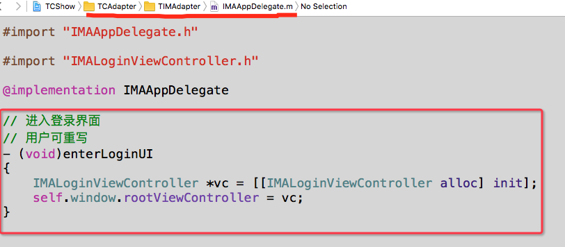

（图一） （图二）

### 常见问题

1.  如何自定义登录界面？已有登录界面，如何支持？

    用户在自己的AppDelegate中重写enterLoginUI，在具体实现中调用自己的登录界面即可，其用户自已登录界面的逻辑可参考IMALoginViewController中的实现。使用时，用户根据具体情况手动调用enterLoginUI方法即可。TCAdapter内部主要会调用enterLoginUI进行登录相关的处理。

初始化SDK
---------

SDK初始化工作主要是指IMSDK初始化与登录，AVSDK中要startContext。

目前TCAdapter中已封装此块的逻辑，用户只需要了解此节中的步骤即可，如果需要定制，可进入到对应处进行重写。

### IMSDK初始化

TIMAdapter下是将IMSDK进行了封装，初始化IMSDK的工作主要在IMAPlatform中，与初始化IMSDK相关的接口已封装下成面的三步，其调用顺序需要按照下面几步进行：

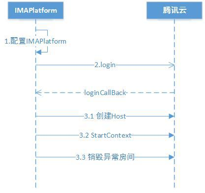

1.  配置IMAPlatform

    配置主要分两个：configIMSDK，configHostClass

    configIMSDK：目前IMAPlatform只配置常用的与直播，互动直播相关的IMSDK项，以及SDK回调处理，用户如有其他逻辑可自行添加配置；

    configHostClass：配置当前用户类型，参数必须为IMAHost子类，可选配置。（若配置时，具体可参考随心播中的TCShowHost）；

    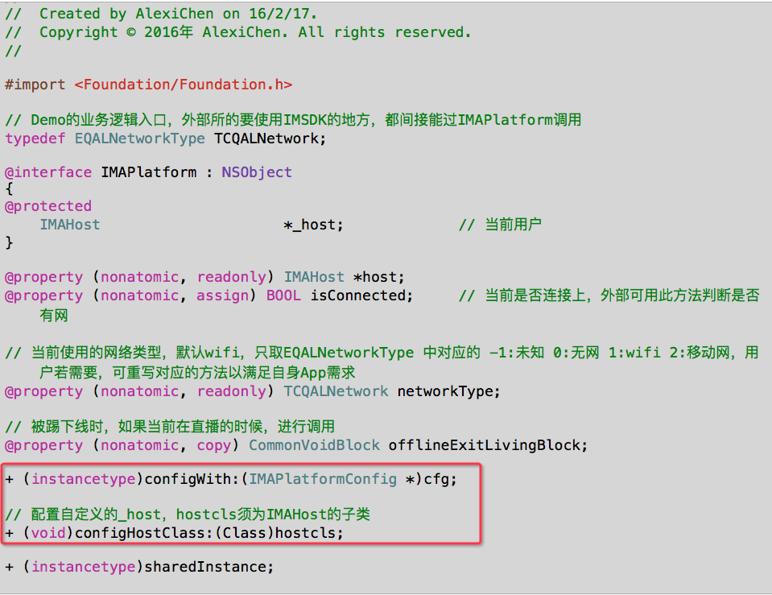

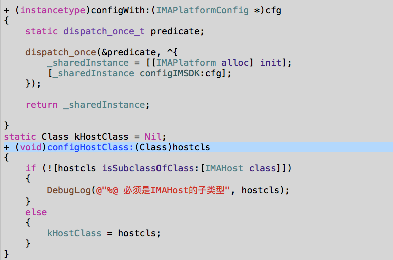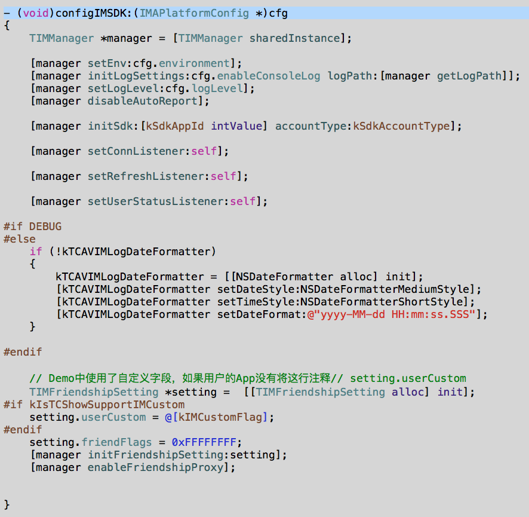

相关的IMSDK回调可参考IMAPlatform+IMSDKCallBack,其主要处理了跟用户登录相关的回调，关系链与群助手回调作空实现（内部未用到这部分的功能）。

1.  登录

    配置完IMAPlatform后，即可调用其封装（主要处理被踢下线逻辑，以及下次自动登录设置）过的登录接口进行登录。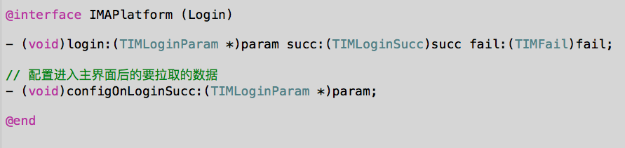

2.  登录成功后配置

    登录成功后，需要调用*上图*中的configOnLoginSucc进行登录成功后的配置。

    *登录后的配置*主要有三小步：创建Host，配置AVSDK上下文，销毁历史房间，三步是并行的不用等回调；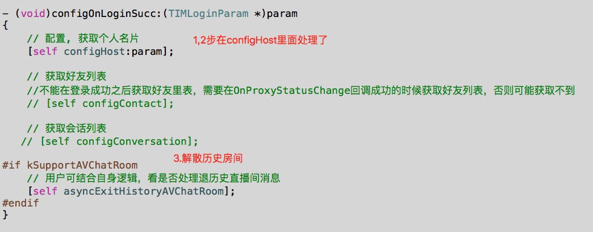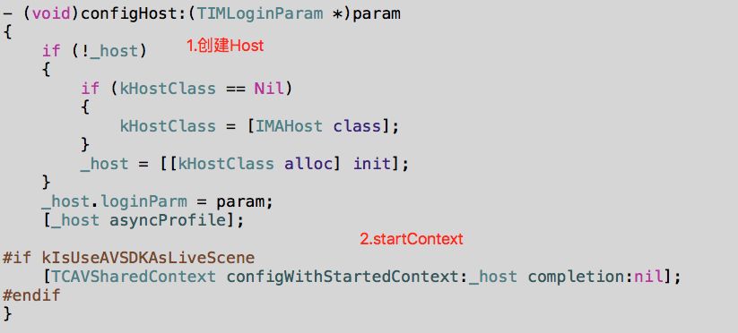

### AVSDK上下文初始化

TCAdapter中将QAVContext封装成单例TCAVSharedContext。理论上AVSDK上下文在登录IMSDK之后（未登出这前）调用均可，TCAdapter中将其放到登录IMSDK之后立即进行上行文创建并startContext，登出时，然后stopContext并销毁。其具体调用处可参考*IMSDK初始化中的第三步*

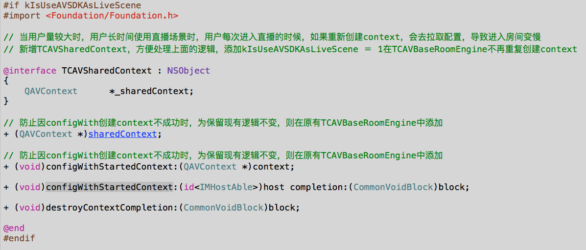

修改云后台编码配置
------------------------------------------------------------------------------------------------------------------

在创建云后台配置时，用户需要清楚自身业务的类型（是直播，还是互动直播）。

然后进入到腾讯云，登录帐号，在后台添加对应的配置。修改应用场为互动直播（如果已是则不用修改）。

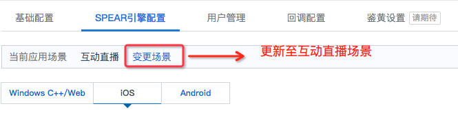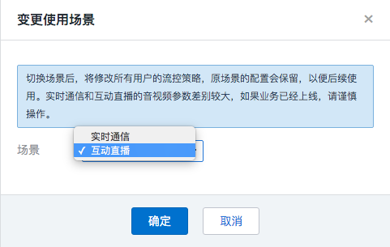

下面结合随心播分开介绍直播与互动直播的SPEAR配置。

### 直播SPEAR配置

直播时，需要配置主播与观众角色两个角色如下：

主播配置：

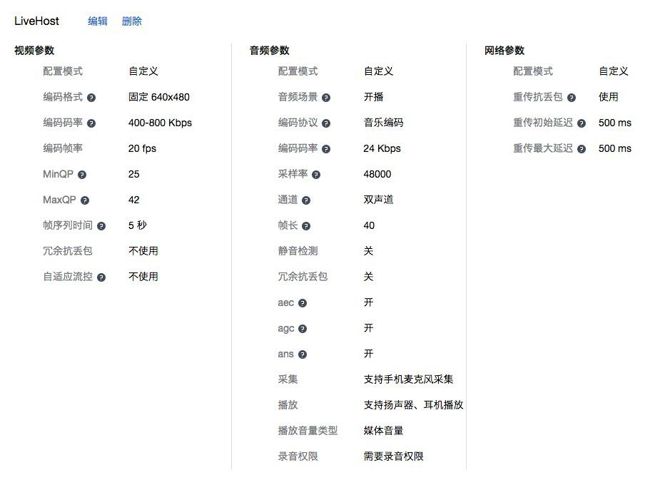

观众配置：

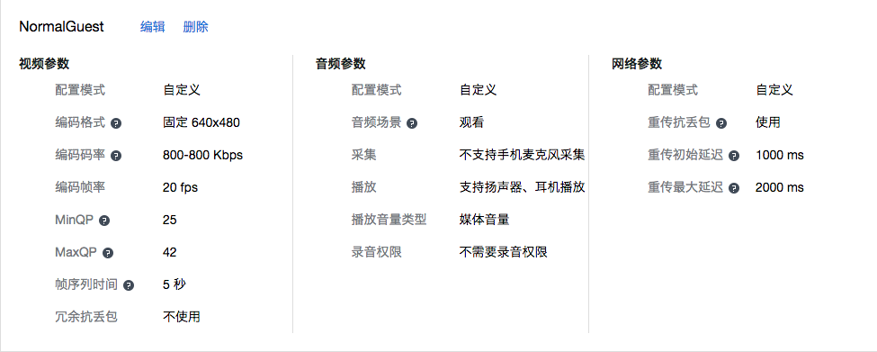

### 互动直播SPEAR配置

主播配置：

普通观众配置：

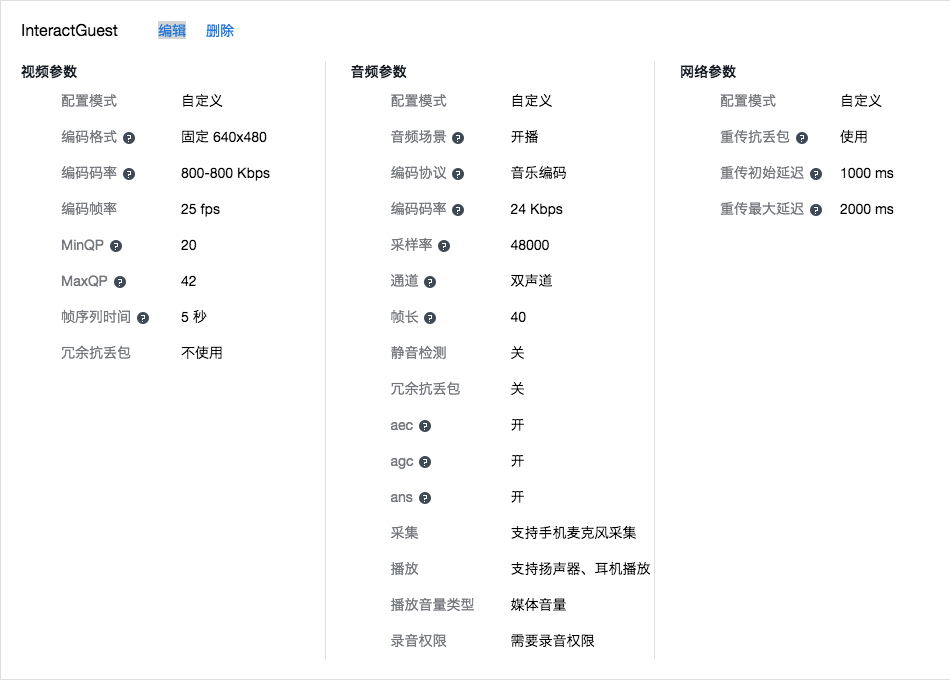

互动观众配置：

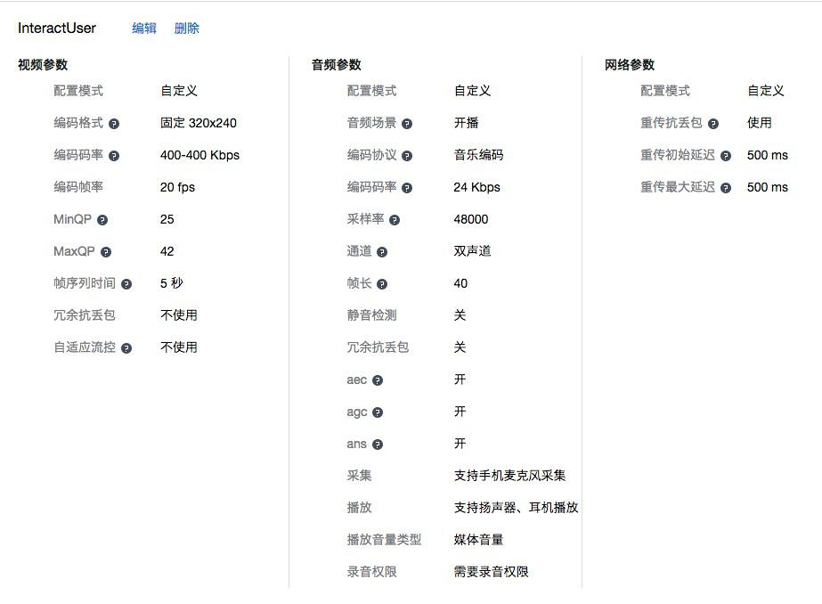

三者区别：

主播：要保证主播的画面质量（主要见视频参数编码格式要高些）以及直播质量（见网络参数，时延较小）；

观众：其视频参数对其影响不大，主要是要将其时延配得相对较大些；

互动观众：其相对于主播画面质量要小些，时延与主播一致；

### 直播/互动直播配置对比说明

由上面的图配可能看出，直播/互动直播主播配置是没区别的，互动直播对比直播多一个互动观众配置，二都的主要区别在于观众的配置中的音频场景不一样：

直播观众：使用观看（不能开Mic）；

互动直播观众：使用开播（可以开Mic）；

二者不同的原因在于：

-   音频场景确认后无法修改，进房间时设定，使用过程中不能修改；

<!-- -->

-   因随心播业务逻辑导致：随心播中主播在互动直播时可以向任意观众发起上麦邀请，所以观众必须配置成开播模式，才可以进行上麦。（各业务App此处可以根据具体业务来决定：互动直播时观众是否使用开播模式，后续*创建房间对象*有作说明）；

    导致的问题：

    使用观看模式时，观看直播时，手机使用的是扬声器音量，按侧边键可以静音；

    使用开播模式时，观看直播时，手机使用的是通话音量，按侧边键不可以静音；

另外请记住配置中使用的角色名（直播：LiveHost，NormalGuest；互动直播：LiveHost，InteractGuest，InteractUser），后续代码中会用到。

如果不配置这些角色，或后续代码中使用了与配置的角色名不对的角色（如主播SPEAR配置为LiveHost，但是实际代码误写成Host），则使用默认生成的user，可能会影响到计费，请开发者注意。

创建直播间对象
---------------------------------------------------------------------------------------------------------

为方便用户进行定制，TCAdapter中的直播间协议，业务方只需要在其对应的数据模型上实现该协议即可传入到TCAdapter中进行使用；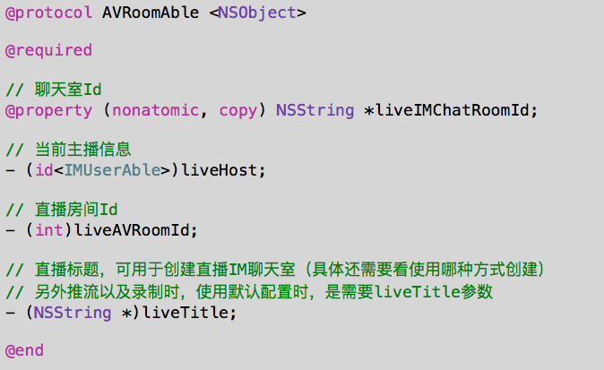

如果本地没有直播间数据模型，且又想对直播间模型进行功能扩充，可参考随心播中的TCShowLiveRoomAble继承AVRoomAble进行协议补充充

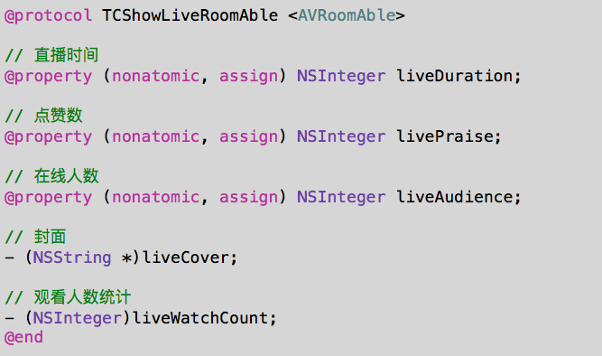

同时声明TCShowLiveItem来实现扩充的TCShowLiveRoomAble协议。

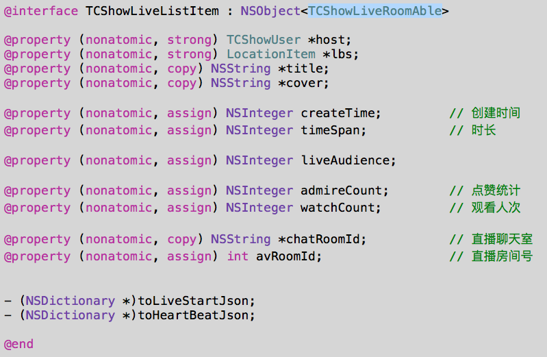

对于前面所说的互动直播时，*如何指定互动观众*，即可通过类似方式来扩展AVRoomAble接口（添加设置互动观众列表接口），然后作对应的实现即可。

另外直播间的管理属于业务逻辑，*随心播后台*提供的公供参考。

其他可参考TCAVIMDemo中的TCAVRoom对象直接实现AVRoomAble协议即可：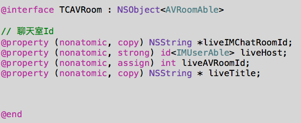

进入直播/互动直播
----------------------------------------------------------------------------------------------------------------

TCAdapter已将创建直播/互动直播流程进行封装，用户只需要清楚好自己的业务类型（直播或互动直播），然后选择对应的TCAdapter中的类进行继承，即可快速进入到直播间，不用自行处理原先的复杂流程。

此节以随心播创建直播、互动直播为例，教大家如何快速开发并进行直播：

### 添加直播/互动直播界面对象

首先根据自己的业务类型选择TCAdapter中具体的类进行继承。

如果是做直播，可继承TCAVLiveViewController

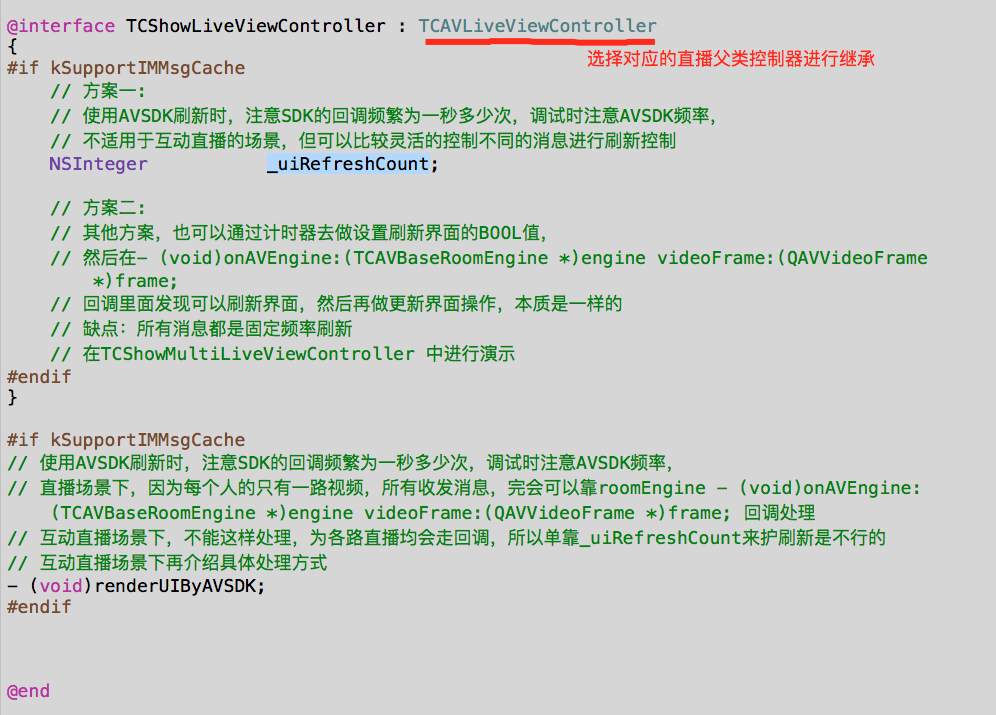

如果是做直播互动直播，可继承TCAVMultiLiveViewController

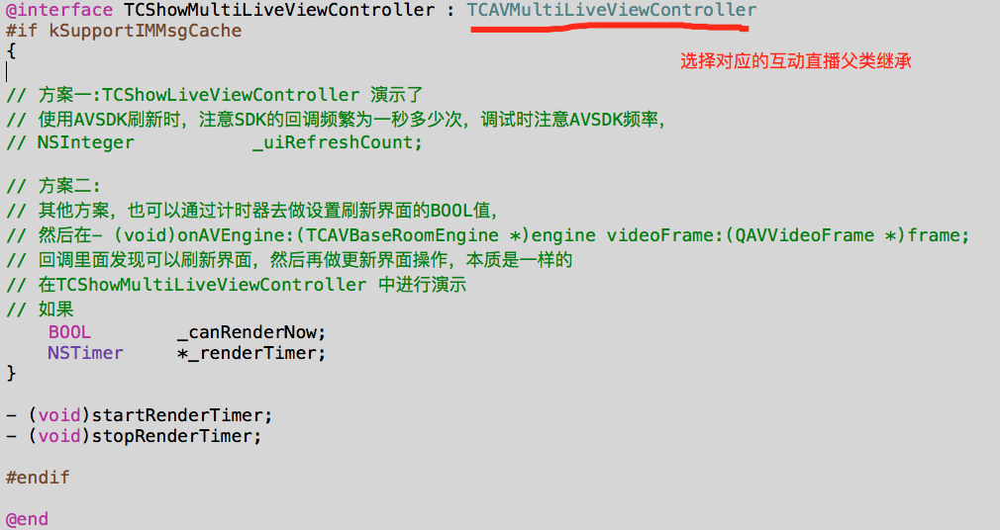

### 创建直播/互动直播

1.  创建直播间，并配置参数；

2.  创建刚添加直播、互动直界面类，并传入直播间参数，以及当前用户的信息；

3.  跳到直播界面；

    （图片中的代码来源于TCShow下的PublishLiveViewController.m）

    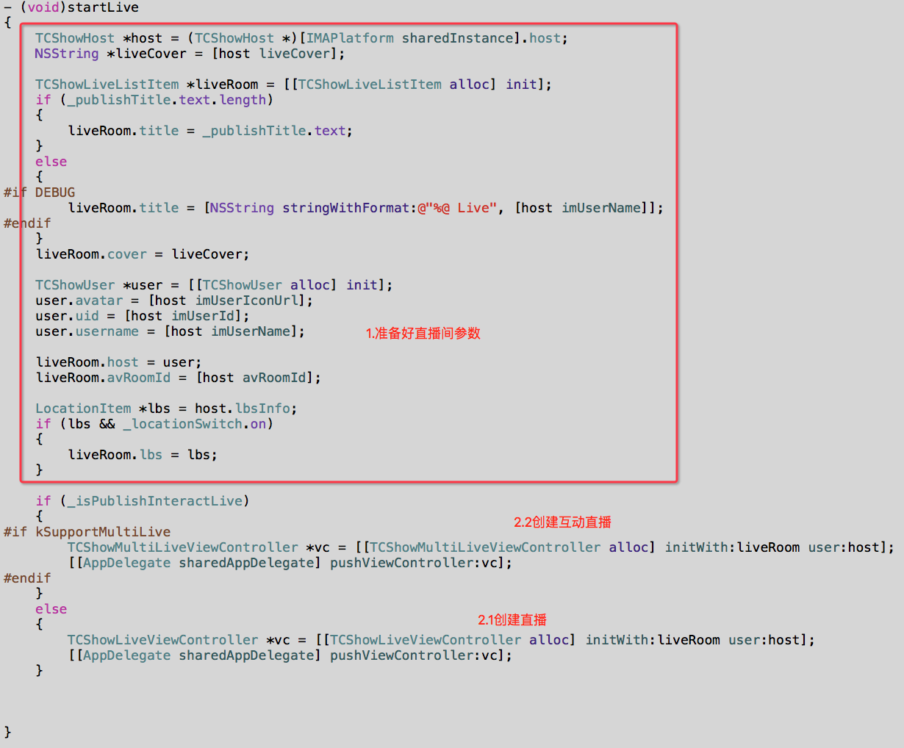

### 加入直播/互动直播

在直播列表界面，显示的是当前在正在进行直播的直播间信息，随意点进一个即可进行观看直播，结合*上图*与*下图*，我们可以发现加入直播间与开始直播间流程是统一的，即为*上述*。

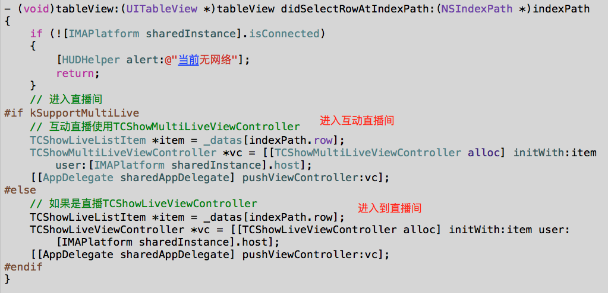

### 注意事项

创建直播、互动直播时，传入的当前用户参数有作参数检查，如果没人实现对应要求的协议会抛异常，这可能会导致程序崩溃。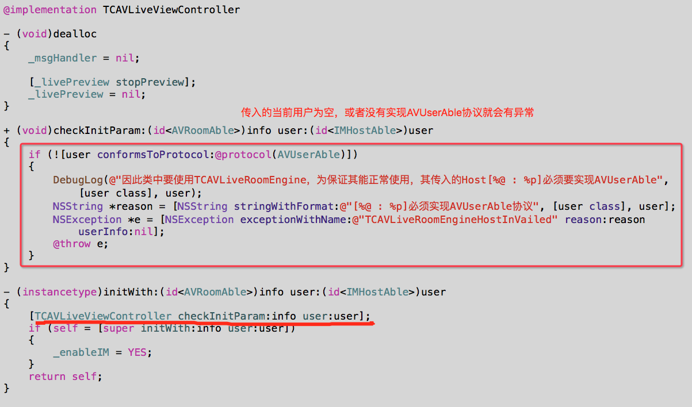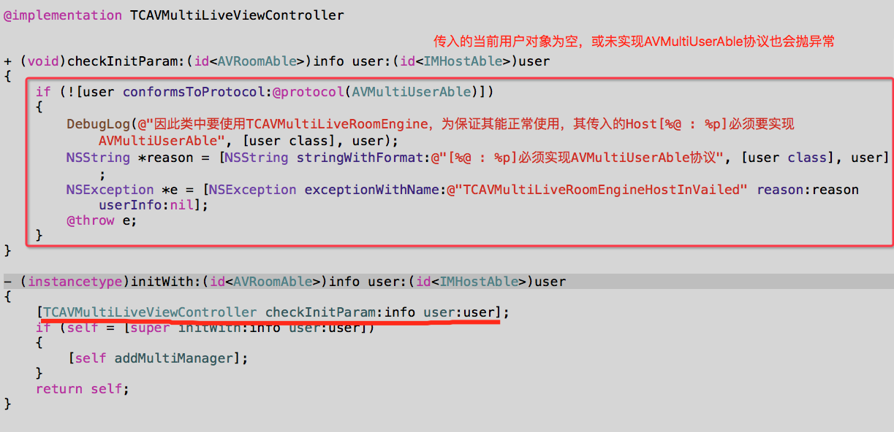

而IMAPlatform中默认的IMAHost己实现该协议，在*前面*我们有介绍，可以指定Host具体的类型必须为IMAHost子类，所以其实在创建直播我们要保证登录过IMSDK，并*成功拿到用户信息*，保证IMAPlatformHost不为空。

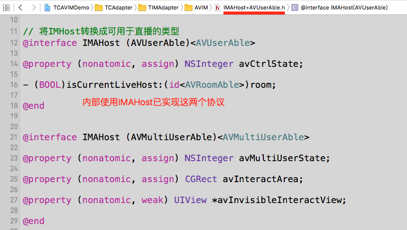

进入房间后的配置
----------------

在完成上面的步骤后，进入房间还是使用TCAdapter中的默认配置（TCAdapter因为不清楚用户的Spear配置，其内部使用的均是默认配置），所以对应的这块需要用户重写对应的方法进行配置，这样的配置主要以下三处，下南结合随心播配置进行说明：

1.  角色配置：直播引擎配置

2.  权限配置；直播引擎配置，涉及OC/DC机房，会影响计费，请谨慎配置。

3.  进入房间后操作配置；直播界面控制

    在*上一节*中，我们创建了属于自己业务的直播界面，但是使用的时候发现其中配置的直播引擎不符合我们的要求，那如何进行处理？

    在*TCAdapter模型*中，我们知道每个直播界面控制器都有一个直播引擎，我们需要指定该创建配套的直播引擎即可。

    下南以随心播为例，讲解如何接入自定义引擎；

### 接入自定义直播引擎

1.  创建自定义引擎：这里主要根据自身业务（直播、互动直播）去选择对应的类继承，直播继承TCAVLiveRoomEngine，互动直播继承TCAVMultiLiveRoomEngine

    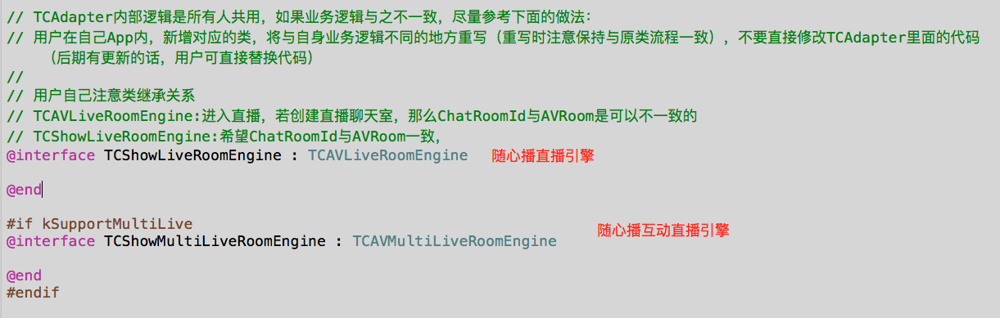

2.  接入自定义引擎：重写*上一节*中创建的直播控制器类的createRoomEngine方法。可以通过对比发现，重写的时候我们只需要换将引擎类型名换成第一步创建的自定义引擎类即可。

    随心播直播引擎重写：

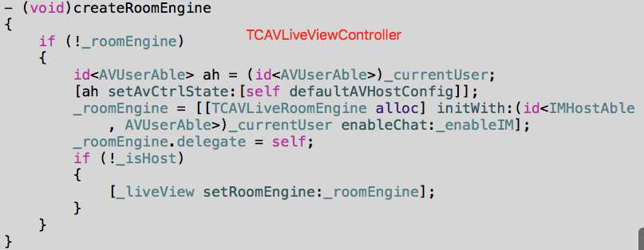 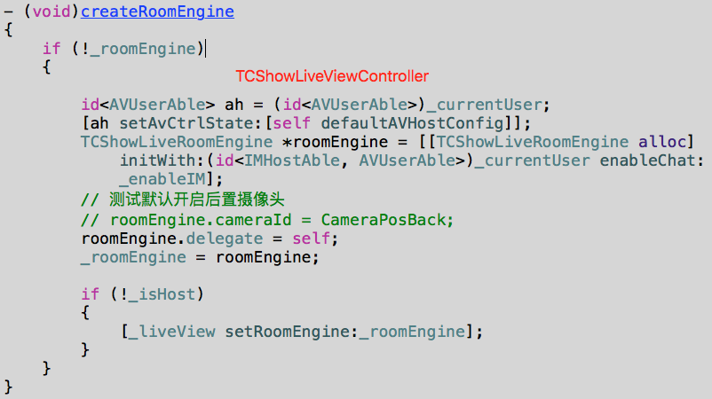

随心播互动直播引擎重写： 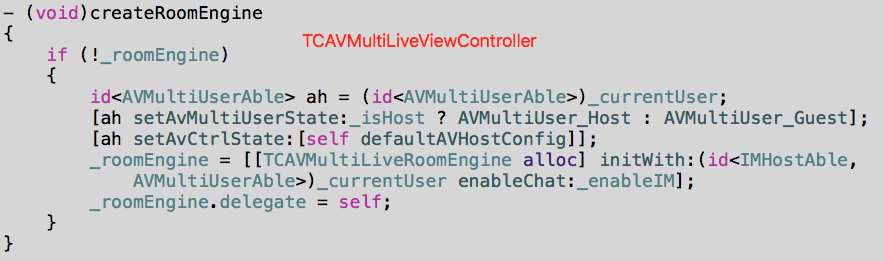 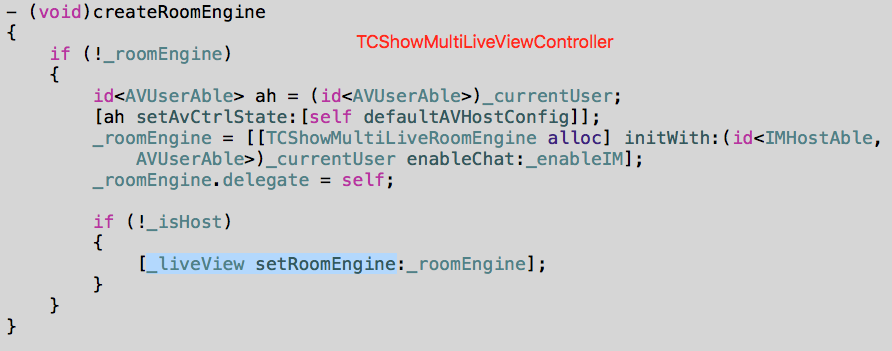

### 配置角色权限以扩进房间后的操作

1.  角色配置（进入房间前配置）：TCAdapter默认使用角色为空（即为Spear中默认的User，*说见说明*），用户根据*前面的去平台配置说明*以及结合自身业务逻辑（比如前面所说的*如何指定互动观众*，在此处则要配置互动观众的角色，随心播里面只配置两个是因为其业务逻辑中的互动用户是在进房间后指定的，后面会介绍如何*邀请上下麦*中会介绍）进行重写roomControlRole方法；

    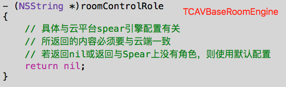 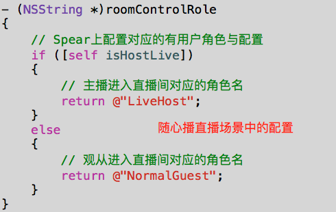 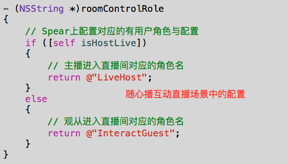

2.  权限配置（进入房间前配置）：TCAdapter默认进入房间的配置是主播权限全开，观众只有加入房间以及接收权限，随心播中默认使用该配置，即没有重写该方法。此处配置依然要结合用户自身业务逻辑去重写roomAuthBitMap方法。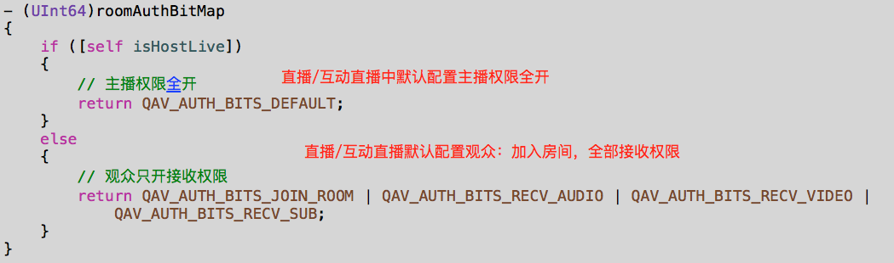

    比如TCAVIMDemo中的二人视频电话Demo中，通话双方进入都可以打开摄像
    头以及Mic，进入的配置即为权限全开 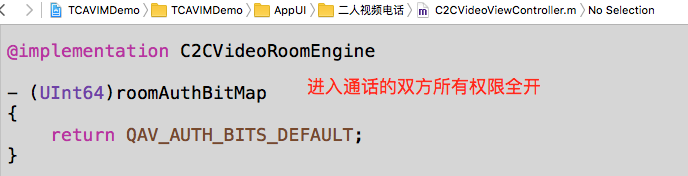

    TCAVIMDemo中的二人语音电话Demo中，通话双方进入后只用打开Mic，扬
    声器，进入的配置即主要是配置音频接收与发送权限；
    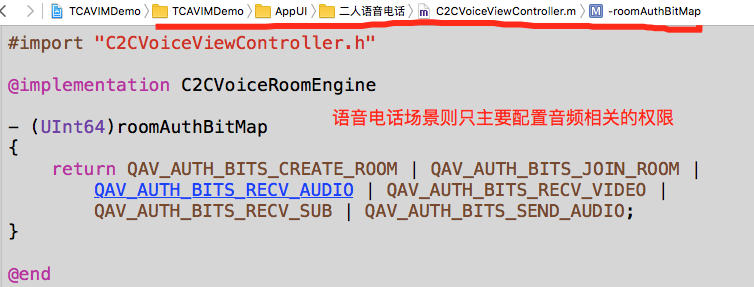

3.  进入房间后的操作（进入房间后配置）：TCAdapter中将一般进入房间后常用的操作又容易出错的地方进行了封装，这些操作包括：打开摄像头，麦克风，扬声器，美颜，推流，录制，美白等。角户进入房间时，只需要配置相应的操作，TCAdapter中默认为将其执行，不需要用户自行写代码进行操作，具体指定时，只需要重写直播界面控制器的defaultAVHostConfig方法。

    操作对应的操作命令字如下：

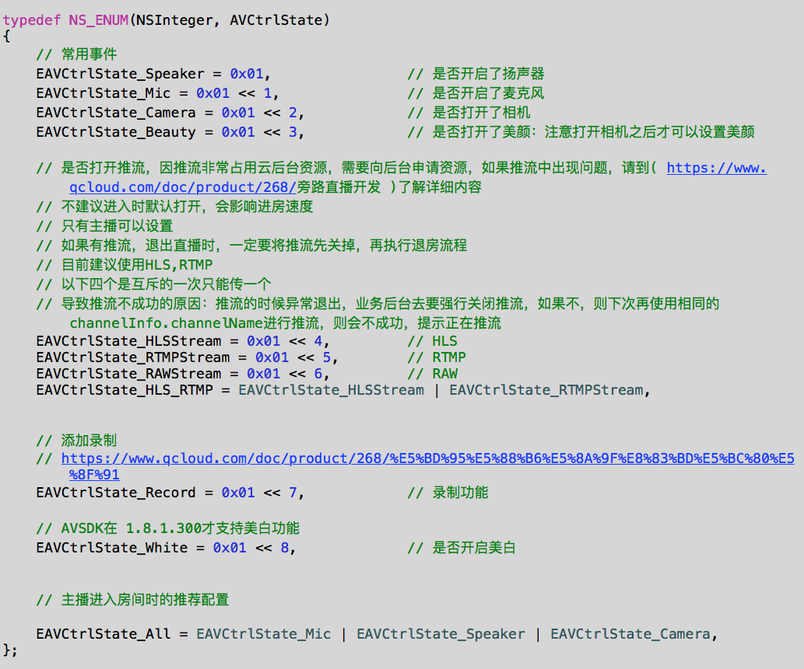

TCAdapter中的默认配置如下，随心播直播、互动直播都是使用这一默认配 置。

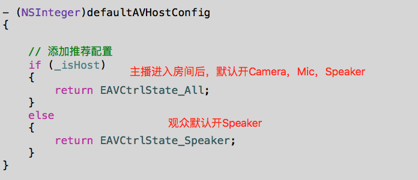

下面以TCAVIMDemo中的二人语音电话，以及二人视频电话作讲解：语音电话，
通话双方只用开Mic，Speaker，而视频电话则还要开Camera

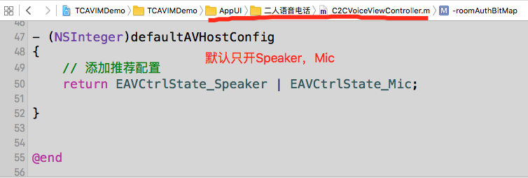 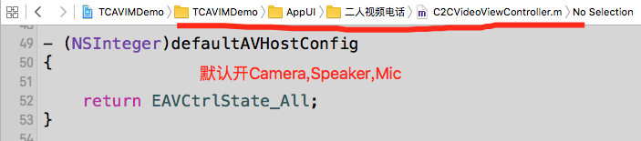

更多重写细节可参考*进房间流程定制*

退出直播/互动直播
-----------------

TCAdapter已将退出直播/互动直播流程进行封装，对应的方法好下，请注意阅读注释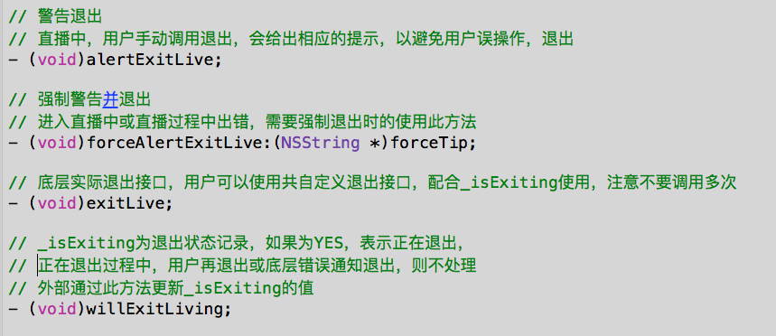

*退出房间后，注意检查资源是否及时释放*，如果未及时释放，有可能会导致下次直播的时候出错。目前Debug模式下，TCAdapter中退出时会打印出相关的释放日志，用户在开发调试时，请关注该日志，以检查自己添加的代码是否导致资源未释放问题。

随心播直播资源释放日志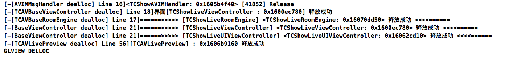

随心播互动直播资源释放日志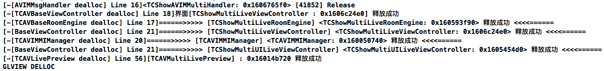

业务UI集成
----------

TCAdapter直播界面控制器将直播画面渲染与用户UI进行了分离，用户可以在其用户UI中操控底层的直播界面控制器，用户可通过下面的两种方式集成自已播UI（注意修改backgroundColor为透明），不推荐直接在前面自定义的直播控制界面上添加控件。

1.  对于新接入的用户，可创建UI界面继承TCAVLiveBaseViewController，在其基础上添加自身App的业务逻辑，随心播中使用这种方法进行；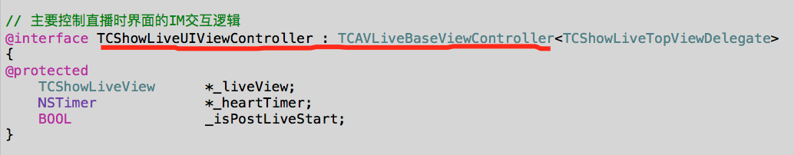

2.  对于已有直播界面的用户，可以让其界面实现TCAVLiveUIAble协议，TCAVIMDemo中二人视频电话示例中使用这种方式；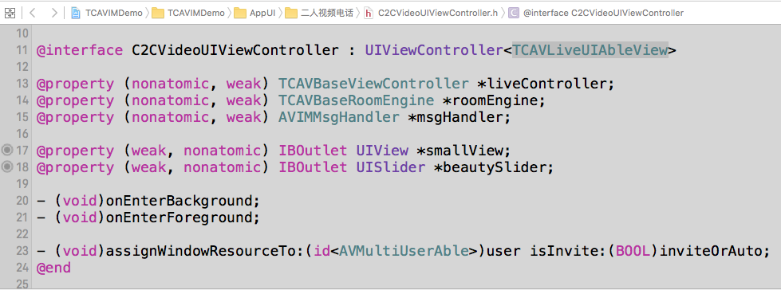

    TCAdapter中默认使用第一种方式，在直播界面控制器上添加了一个透明的无任何内容的UI控制器。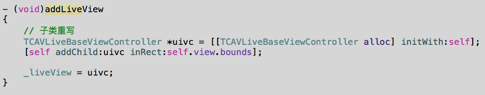

    完成上面的任意一步时，在自定义的直播控制器内重写addLiveView方法，以随心播为例，重写addLiveView方法后，自定义直播控制器上即可显示自定义的UI交互界面了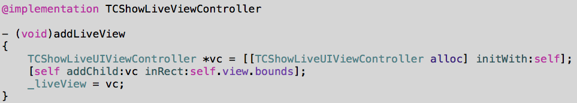

    注意事项：

    用户在其自定义的UI界面调用直播界面控制器时，需要注意内存问题，否则会出现*上述问题*，通常此处相关的操作有：

-   Block使用不当，导致循环引用；

-   计时器未正确释放；

-   其他会导致内存延迟释放相关的操作；

    用户在写自定义UI界面的逻辑时，需要谨慎处理，避免*上述问题*。

自定义渲染控件
--------------

TCAdapter中的直播渲染控件为TCAVLivePreview，互动直播渲染控件为TCAVMultiLivePreview，其内部更侧重于如何将正确将画面如何正确显示出来，而非过多研究怎么展示才好看（横竖屏如何显示），这一块更多地与业务逻辑相关，用户如果觉得画面渲染这块不能符合自身App的需求，可以自定义渲染控件，以及画面分发控制，以达到自身的要求。

TCAdapter直播控制器内配置渲染控件的方法为addLivePreview

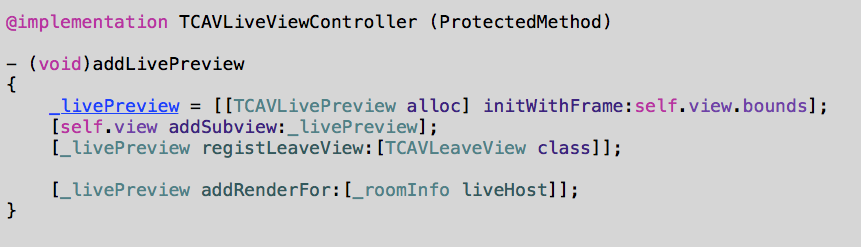

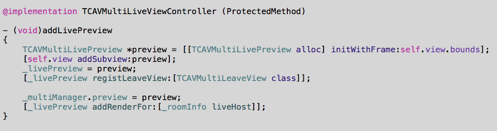

随心播中没有自定义此处，可参考TCAVIMDemo中的下的“修改渲染控件，控制全屏示例”：

1.  自定义界面分发器；

    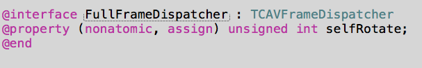

2.  自定渲染控件中使用自定义的分发器；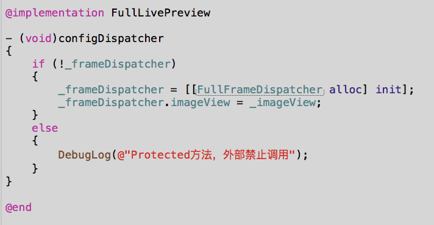

3.  重写直播控制器的addLivePreview方法，添加自定义的渲染控件；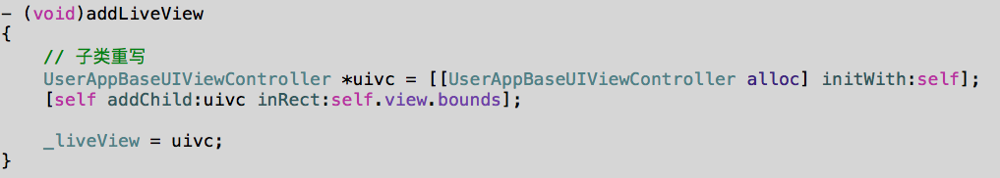

直播中的功能点讲解
==================

该部份主要讲解实际操作中，用户需要关注或可能需要重写的逻辑，这一节内容也是用户比较容易出错的地方。用户在重写以下这些方法时，注意保证逻辑的完整性。另外此章节会根据技术支持群反馈的问题持续更新。

硬件权限以及网络检查
--------------------

### 进入前检查

1.  进入前网络检查

    TCAdapter中的网络通知回调是IMSDK返回的，IMAPlatform对其作如下封装：

    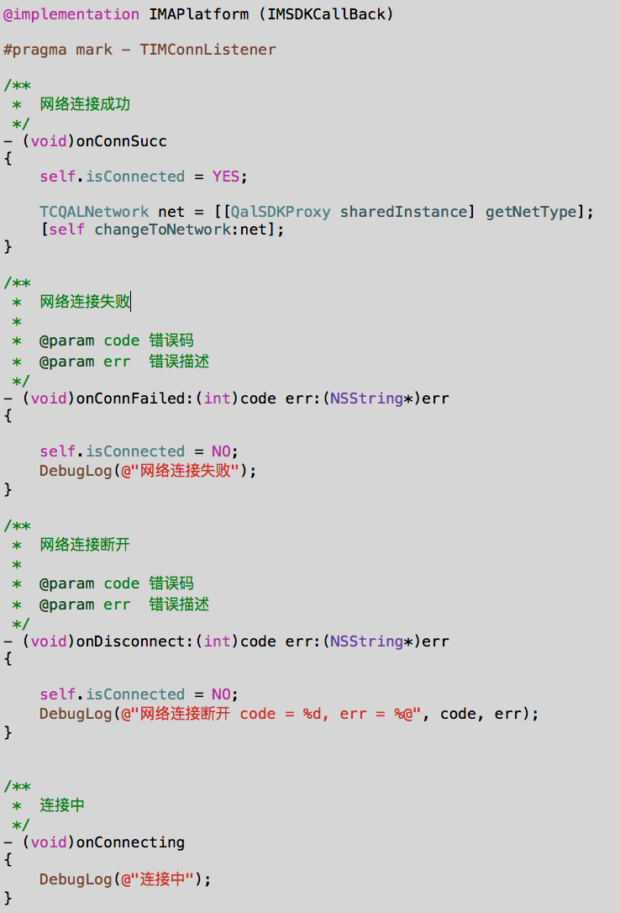

    外部用户如果也想用这一通知，其前提是要执行*这一步*中的configIMSDK，然后在其代码中KVO网络变化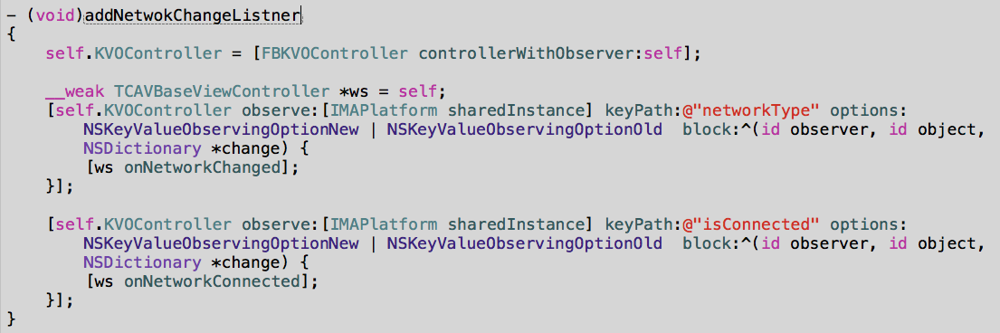

    TCAdapter内部直播前网络检查接口如下：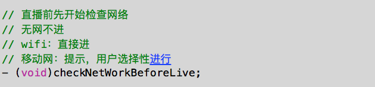

2.  进入前手机权限检查

    权限检查主要相机与麦克风的权限检查，检查的时候会区分不前用户是主播还是观众，同时也跟Spear配置有关。

    TCAdapter中主要是对直播场进行了封装，默认的逻辑是：主播进入时（还未到调用AVSDK相关代码）要检查相机与麦克风权限（但对静音，以及勿扰模式不作检查，这一块会影响音频上行，请开发者注意），观众进入时不检查这些权限。

    但是如果进入时Spear配置音频场景为开播模式时，使用AVSDK，进入房间后，其底层会检查麦克风权限（比如：随心播中互动直播，观众进入时配置的是开播模式，首次使用时使用提麦克风权限检查）。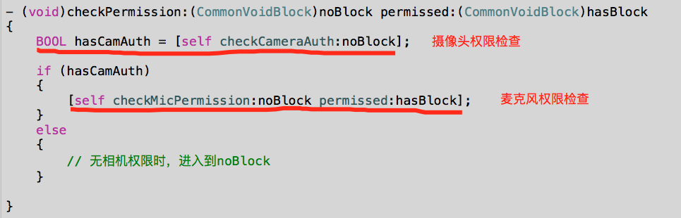

    实际使用时，用户根据自已业务场景与TCAdapter中的一不致，可重写上图中的方
    法即可。

### 使用中检查

1.  使用过程中，如果用户手动去手机设置项是修改了权限，这样会导致使用到对应权限的App重启，这是系统机制。所以TCAdapter使用过程中不再对相机与麦克风权限作检查。

2.  使用过程网络变化监听：TCAdapter中监听了网络断开/连接变化通知（onNetworkConnected），以及网络类型（wifi/移动网络/无网）变化通知（onNetworkChanged），并提供较简单的处理，用户重写这两处以满足自定义效果。

进房间流程定制
----------------------------------------------------------------------------------------------------------

前面介绍过用户集成时，*用户进直播间*时，需要关注的主线流程，下面的几点可能也是用户会关注的，用户根据实际需要进行重写。

-   能否不立即进入直播间：TCAdapter默认直接进入到直播间，如果用户需要在进入直播界面，需要做一些自定义的操作之后再进行，可以重写下在的接口：

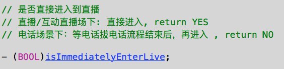

-   直播聊天室是否必须创建：TCAdapter中默认enableIM为YES，用户进入时会根据传入的直播间参数信息中的liveIMChatRoomId去作创建/加入直播聊天室的操作，对于一些业务场景下，用户不需要聊天室操作，或外部已经有聊天室的情况时，可以通过下图红框中的参数进行设置，注意阅读注释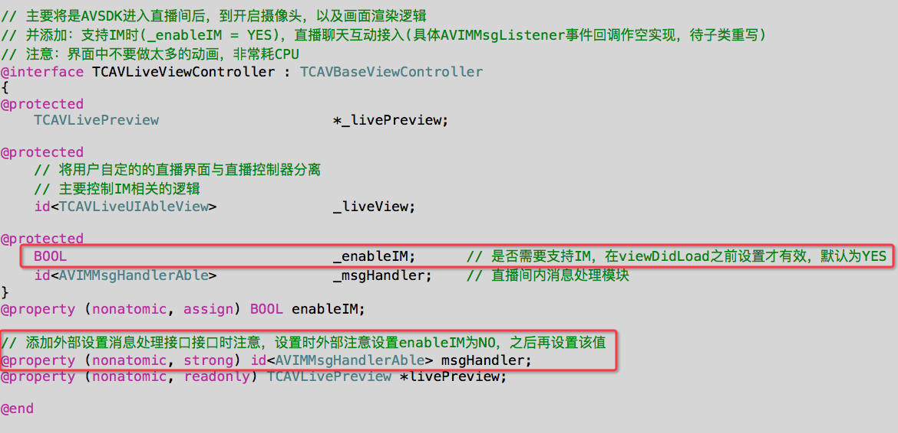

同时如果自定设置时，注意根据具体情况设置消息的回调处理，此处可能有
调试工作，用户谨慎处理。

-   美颜、美白默认参数自定义：TCAdapter中如果在*进入房间后配置*中配置了自动开启美颜或美白（前提是必开相机才有效），进入房间成功后，在打开相机后，会默认对应打开美颜或美白，此时二者对应的默认值均为5，有户可在其*自定义引擎*中可重写该值：

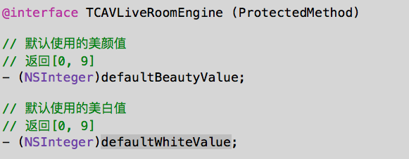

-   退出时能否不解散/退出聊天室：TCAdapter中的直播场景在退出直播间后，会默认退出群，但对于一些非直播业务场景下，用户并不想这么做，这时用户可在其*自定义直播界面控制器*重写以下方法：

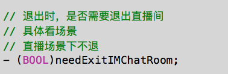

推流/录制
---------

TCAdapter中推流相关的代码在TCAVLiveRoomEngine+PushStream中，录制相关的代码在TCAVLiveRoomEngine+Record。TCAdapter中默认会管理推流操、录制操作：正常退出时，会自动结束推流、录制，使用过程中也可以手动停止。但异常退出时，业务端需要到后台手动关闭相关的操作；当然用户也可能参考此部分的代码，进行重写，或自行实现，自行实现时注意退出直播时，一定要关掉对应开启的推流与录制。

### 推流设置

目前代码中支持两种方式让主播开启推流

1.  启动过程中配置：在进房间后，像其他开Mic，Camera一样配置即可，退出时，TCAdapter自动检查是否有

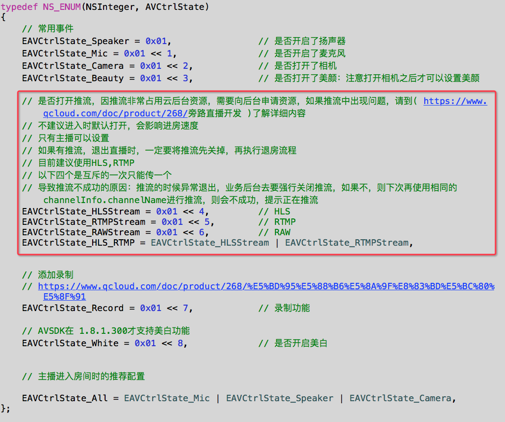

代码中进行监听推流回调（详见TCAVRoomEngineDelegate）；
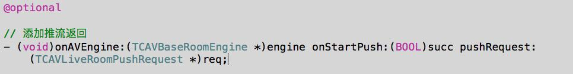

1.  用户手动调用开始与结束推流代码；

    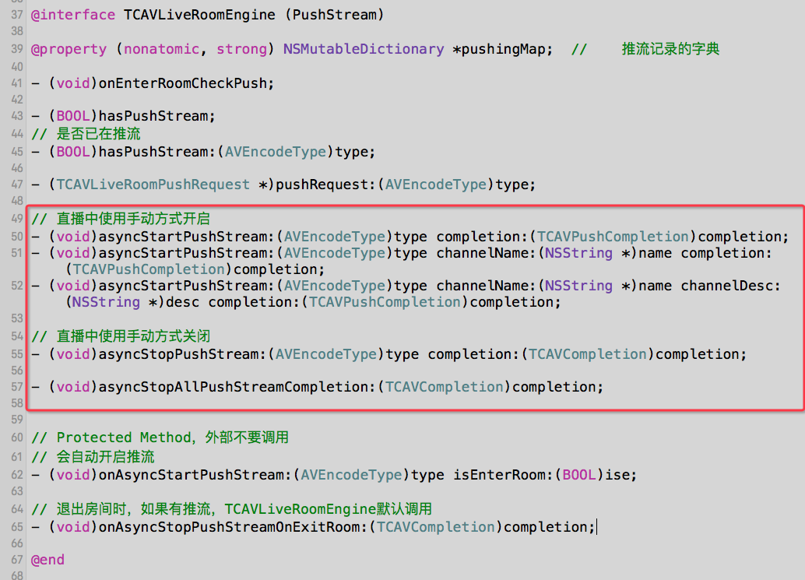

    注意启动时配置时，推使用观察者回调，直播中使用block回调；

### 录制设置

录制相关的代码在TCAVLiveRoomEngine+Record中，目前代码中支持两种方式让主播开启录制：

1.  启动过程中配置：在进房间后，像其他开Mic，Camera一样配置即可（同上推流处中使用EAVCtrlState\_Record）

代码中进行监听录制回调（详见TCAVRoomEngineDelegate）；
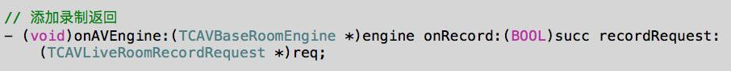

1.  用户手动调用录制代码；

    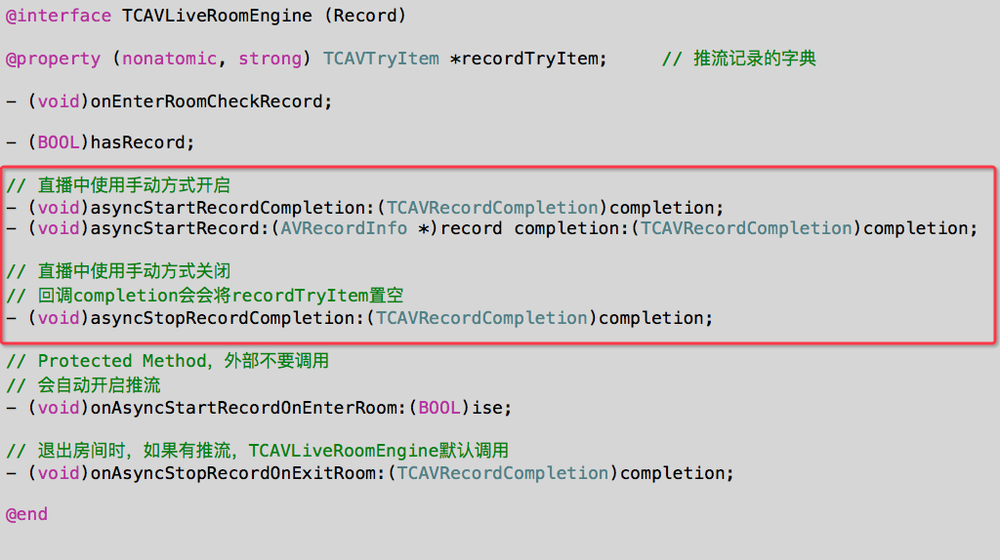

    注意启动时配置时，推使用观察者回调，直播中使用block回调；

中断处理
--------

### 电话中断

TCAdapter中进入直播间成功后会添加电话监听(addPhoneListener),App在前台直播中如果有电话中断，其会自动进行处理（handlePhoneEvent）：被电话中断时，会切换到电话界面，相当于App会进行退后台处理，电话结束时，App自动切换到至前台，进行前台处理。

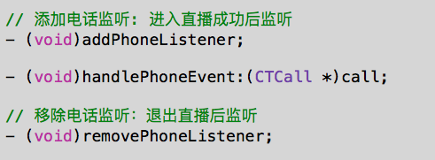

### 前后台切换

直播过程中，前后台切换事件处理（此处说明一下子类有对此事件进行重写）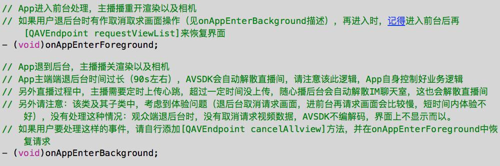

用户在开发自己的App过程中，经常反馈会退后有声音无画面问题，而随心播没有，原因随心播没有配置后台模式，而用户的App配置了后台模式导致。当用户App有后台模式的时候，TCAdapter中默认会在前后台切换时，会执行开关mic操作，来处理这样的逻辑。用户若想让其退后台仍可声音可重写该方法（有后台模式的前提下），可让自己的app在退后台仍可继续进行录音。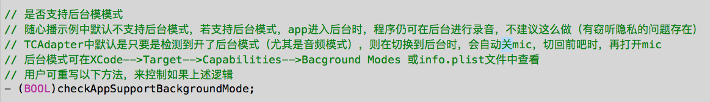

### 音频中断

直播过程中有可能会有输入法，闹铃，或其他音频相关的中断，TCAdapter中，会添加相关的中断监听，并统一在下图的代码中进行处理了。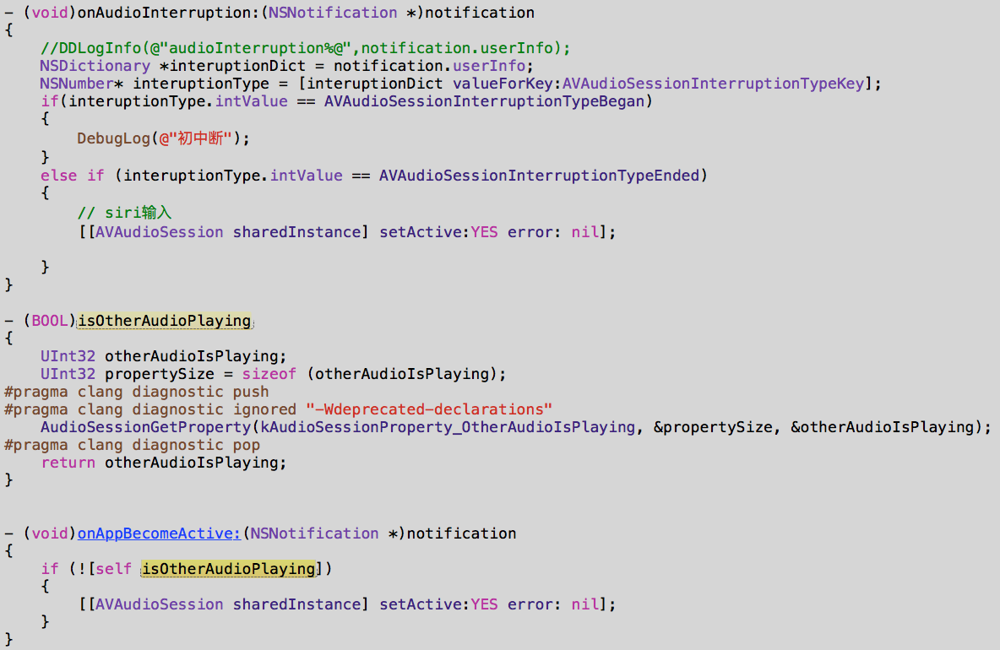

另外需要注意的是：在进入房间前的会记发当前的AVAudioSession中相关的参数，以便离开房间时，可以恢复到进入前的配置。

### IM互踢

使用过程中，如果用户帐号在其他手机上登录了并开启直播的话，会导致直播时画面出错。所以在TCAdapter里面，当我们进入到TCAVBaseViewController中是，重新要设置IMSDK的TIMUserStatusListener监听者为自己（之前是IMAPlatform）。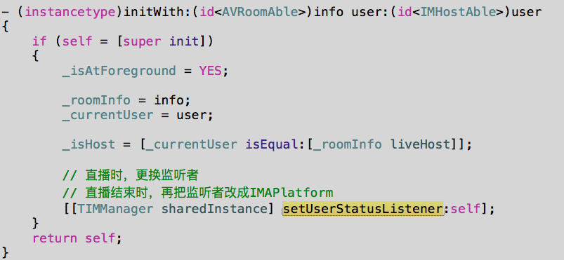

直播结束时，再设置回IMAPlatform

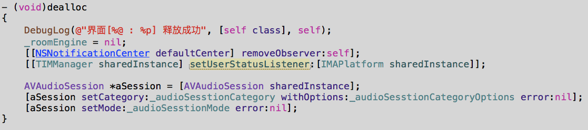

直播中处理互踢以及sig过期等操作

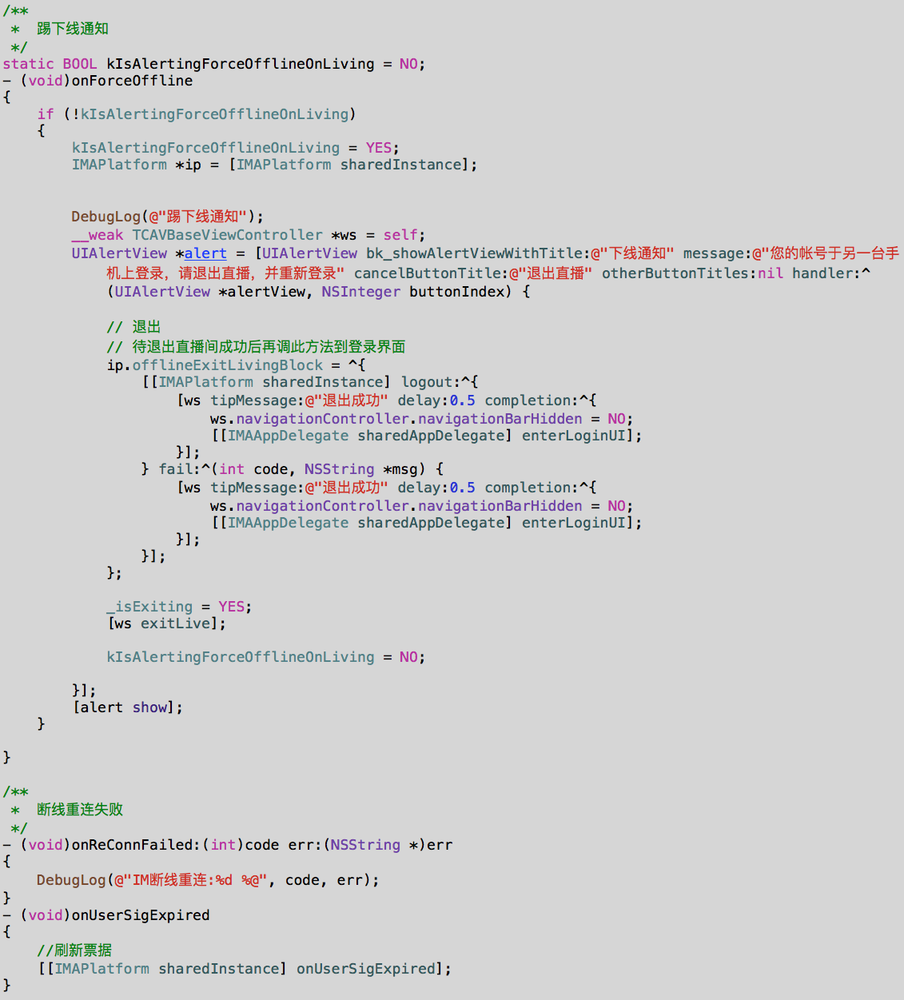

上麦/下麦流程
-------------

上麦/下麦是互动直播才用到，用户上麦流程:

1.  本地检查手机是否有使用Camera/Mic权限，如果没有权限不能进行后续操作；

2.  修改权限；

3.  修改Role(NormalGuest--&gt;InteractUser)；

4.  前两步操作完后，再打开camera/mic；

    用户下麦流程：

    1\. 关camera/mic

    2\. 修改权限

    3\. 修改Role(InteractUser--&gt;NormalGuest)

    TCAdapter中对此流程进行了封装，用户可根据自己的业务逻辑，要上麦的用户，在合适的时机调用以下接口进行上麦。

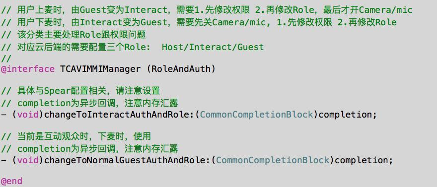

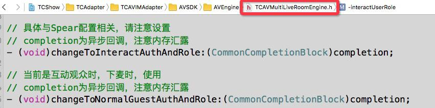

具体流程请搜索代码中上图中的函数。

性能优化
--------

当主播端短时间内收发大量消息时，如果采用即时显示，那么消息的显示会抢占CPU，无法保证AVSDK采集以上行数据
，这样观众端看到的画面会有卡顿，

关于大量收到IM消息时性能调优原则：

1.  减少IM消息显示频率:将IM消息进行缓存（或IM消息合并），以固定频率进行刷新；

2.  减少界面上的动画，增加动画缓存：

3.  在AVSDK回调中进行刷新：

4.  IM消息在显示前，先在子线程中将要显示的内容先计算出来，不要等到主线程中计算；

5.  界面上使用性能更好的代码；

    如何验证：使用WorkSpace中的LiveIMTool，配置成与App相同的Appid，然后用LiveIMTool加入到相同直播聊天室，输入参数控制发消息间隔，然后查看大消息下的效果，并进行性能调化。

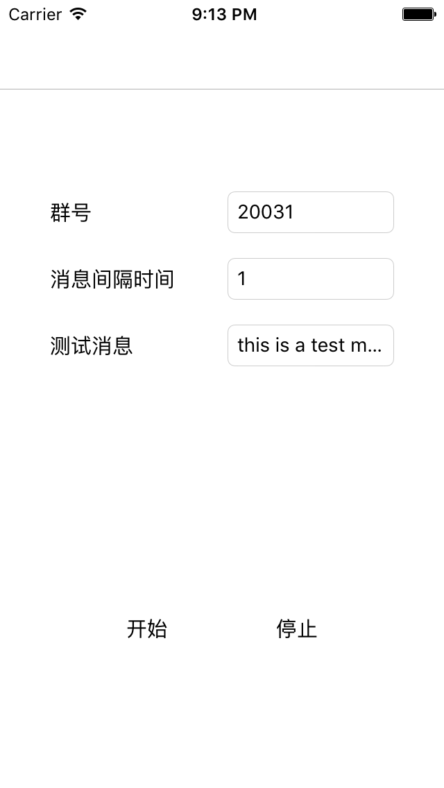

用户也可参考该LiveIMTool的代码，自己写测试代码进行验证。

另外请注意目前直播中使用的是AVChatRoom是有频率控制，具体参数设置请咨询IMSDK技术支持。

Demo中支持立即显示与缓存后显示，详见编译宏kSupportIMMsgCache，用户可通过修改此值，并与LiveIMTool结合进行，可检查大消息量下自己App是否有卡顿效果。
****